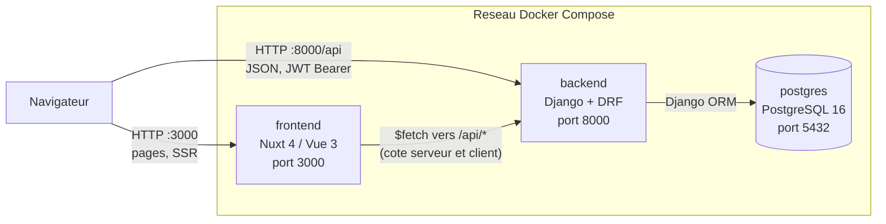
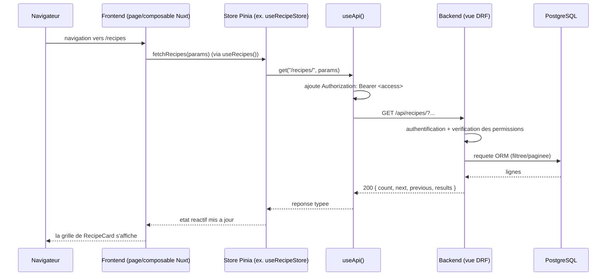

# Architecture

[🇬🇧 English](architecture.md) | 🇫🇷 Français

## Sommaire

- [Vue d'ensemble](#vue-densemble)
- [Services](#services)
- [Comment les services communiquent](#comment-les-services-communiquent)
- [Cycle de vie d'une requête](#cycle-de-vie-dune-requête)
- [Organisation des apps backend](#organisation-des-apps-backend)
- [Organisation du frontend](#organisation-du-frontend)
- [Dev vs prod](#dev-vs-prod)
- [Où aller ensuite](#où-aller-ensuite)

Ce document est le point d'entrée pour comprendre l'architecture système de
SUPMEAL : quels services existent, comment ils communiquent entre eux, et où
trouver plus de détails. Pour le schéma de base de données, voir
[`docs/database.md`](database.fr.md), pour l'API HTTP complète voir
[`docs/api.md`](api.fr.md), pour le flux OAuth Microsoft voir
[`docs/oauth.md`](oauth.fr.md), et pour la structure interne du frontend
(composants/composables/stores/pages) voir [`docs/frontend.md`](frontend.fr.md).

---

## Vue d'ensemble

SUPMEAL est une application web de recettes / cookbooks / planification de
repas, construite comme trois conteneurs orchestrés par Docker Compose :

- **`postgres`** - PostgreSQL 16, la source de vérité unique.
- **`backend`** - Django + Django REST Framework, expose une API JSON sous
  `/api/`.
- **`frontend`** - Nuxt 4 (Vue 3), une SPA rendue côté serveur qui consomme
  cette API en HTTP.

Il n'y a pas de couche temps réel/websocket séparée : tout, y compris la
fonctionnalité de discussion par cookbook, passe par de simples appels REST
(voir [Comment les services communiquent](#comment-les-services-communiquent)).

## Services

- Le **navigateur parle aux deux services** `frontend` (pour les
  pages/SSR) et directement à `backend` (pour les appels API faits côté
  client, puisque `useApi()` cible `runtimeConfig.public.apiUrl` - voir
  [`nuxt.config.ts`](../frontend/nuxt.config.ts)).
- `frontend` peut aussi appeler `backend` côté serveur pendant le SSR, avec
  la même `apiUrl`.
- `backend` est le seul service autorisé à joindre `postgres`. En prod
  (`docker-compose.prod.yml`), postgres ne publie aucun port sur l'hôte,
  uniquement le réseau interne compose - voir [Dev vs prod](#dev-vs-prod).
- Rien d'autre ne se trouve sur le chemin de la requête : pas de reverse
  proxy, pas de file de messages, pas de cache, pas de serveur websocket.
  L'authentification est du JWT sans état, donc n'importe quelle instance
  backend peut servir n'importe quelle requête.

## Comment les services communiquent

**Frontend → Backend : REST en JSON, auth JWT bearer.**

- `frontend/app/composables/useAPI.ts` (`useApi()`) est le client HTTP
  unique utilisé partout dans le frontend : `get/post/put/patch/del`
  construits sur `$fetch` de Nuxt, URL de base issue de
  `runtimeConfig.public.apiUrl`.
- Il lit le token d'accès depuis `useToken()` et pose
  `Authorization: Bearer <access>` sur chaque requête ; `Content-Type` est
  mis à `application/json` sauf si le corps est un `FormData` (upload
  d'image/fichier).
- Sur un `401`, il vide la session locale et redirige vers `/login` côté
  client - il n'y a pas de rejeu silencieux via le refresh token à
  l'intérieur de `useApi()` lui-même (le refresh est un appel explicite
  séparé - voir [`docs/oauth.md`](oauth.fr.md) et
  [`docs/api.md`](api.fr.md#authentication)).
- Aucun composable ni composant n'appelle `$fetch`/`fetch` directement vers
  le backend en dehors de `useApi()`, à une exception volontaire près :
  `CookbookDiscussionSidebar.vue` utilise lui aussi `useApi()` directement
  (pas via un store Pinia) pour appeler les routes de messagerie imbriquées
  (`/cookbooks/{id}/messages/`,
  `/cookbooks/{id}/recipes/{id}/messages/`,
  `/cookbooks/{id}/plannings/{id}/messages/`) - voir
  [`docs/frontend.md`](frontend.fr.md#stores) pour comprendre pourquoi il
  n'y a pas encore de store de messages dédié.
- Tout le reste passe par un store Pinia (`useRecipeStore`,
  `useCookbookStore`, `usePlanningStore`, `useUserStore`,
  `useImportExportStore`) qui encapsule des appels `useApi()` - l'inventaire
  complet de chaque action de store et de la route qu'elle appelle est dans
  [`docs/frontend.md`](frontend.fr.md#stores).

**Backend → Base de données : Django ORM, synchrone, WSGI.**

- `backend/config/wsgi.py` est ce qui sert réellement les requêtes
  (`gunicorn config.wsgi:application` en prod, `runserver` en dev, voir
  [Dev vs prod](#dev-vs-prod)). `asgi.py` existe (scaffolding par défaut de
  Django) mais rien dans la stack ne l'exécute - il n'y a pas de serveur
  Channels/ASGI dans `pyproject.toml`, donc pas de support websocket malgré
  la présence du fichier.
- L'authentification utilise `djangorestframework-simplejwt` : access
  token 60 min, refresh token 7 jours. `POST /api/users/logout/` blackliste
  les deux. Voir [`docs/api.md`](api.fr.md#authentication) pour le contrat
  complet.
- L'OAuth (Microsoft uniquement, pour l'instant) est géré **entièrement côté
  serveur** - le frontend ne voit jamais le secret client, il ne fait que
  transmettre un `code` d'autorisation au backend. Diagramme de séquence
  complet dans [`docs/oauth.md`](oauth.fr.md#fonctionnement-du-flux-microsoft).

## Cycle de vie d'une requête

Lecture authentifiée typique (ex : ouvrir la liste des recettes), de bout en
bout :

Si le token d'accès est manquant/expiré, `useApi()` réagit au `401` qui en
résulte en vidant la session et en redirigeant vers `/login` (voir
[Comment les services communiquent](#comment-les-services-communiquent)) ;
le rafraîchir avant que cela n'arrive est un flux explicite séparé, décrit
dans [`docs/api.md`](api.fr.md#authentication).

## Organisation des apps backend

Le backend est découpé en cinq apps Django par domaine, plus un petit
module `common` pour les aides transverses (aujourd'hui uniquement la
validation d'upload d'image, `backend/common/image_validation.py`). Le
détail au niveau des modèles est dans
[`docs/database.md`](database.fr.md#app-layout) ; ce sont les mêmes apps
qui structurent [`docs/api.md`](api.fr.md) :

| App | Responsabilité | Doc API |
| --- | --- | --- |
| `users` | Comptes, auth JWT, OAuth Microsoft | [§1](api.fr.md#1-accounts--authentication-users) |
| `cookbooks` | Cookbooks + partage | [§2](api.fr.md#2-cookbooks-cookbooks) |
| `recipes` | Recettes, tags, ingrédients | [§3](api.fr.md#3-recipes-tags--ingredients-recipes) |
| `planning` | Planification de repas | [§4](api.fr.md#4-planning-planning) |
| `messaging` | Fils de discussion par cookbook/recette/planning | [§5](api.fr.md#5-messaging-messaging) |

`config/` est le projet Django lui-même : `settings.py`, `urls.py` (monte
le routeur de chaque app sous `/api/`), `wsgi.py`/`asgi.py`.
`drf-spectacular` sert une UI OpenAPI interactive sur `/api/docs/` (voir
[`docs/api.md`](api.fr.md#interactive-docs)).

## Organisation du frontend

Le frontend est une app Nuxt 4 standard (`frontend/app/`), organisée par
nature de fichier plutôt que par fonctionnalité :

| Dossier | Contenu |
| --- | --- |
| `pages/` | Routes basées sur les fichiers - une page par écran |
| `components/` | Composants Vue présentationnels/réutilisables, groupés par sous-dossier de domaine |
| `composables/` | Logique réactive réutilisable (`use*.ts`), y compris les composables « edit view » qui relient une page à son store |
| `stores/` | Stores Pinia - le seul endroit (à part `CookbookDiscussionSidebar.vue`, voir ci-dessus) qui appelle `useApi()` |
| `layouts/` | `app.vue` (coquille authentifiée : sidebar + toasts + sidebar de discussion) et `empty.vue` (nue) |
| `middleware/` | `auth.global.ts` - garde de route exécutée à chaque navigation, protège les routes authentifiées et redirige les utilisateurs déjà connectés hors des pages réservées aux invités |

Un inventaire complet et croisé de chaque composant, composable, store et
page - la référence « quel fichier toucher pour X » - se trouve dans
[`docs/frontend.md`](frontend.fr.md).

## Dev vs prod

Les deux sont de simples Docker Compose, sans orchestrateur, définis côte à
côte à la racine du dépôt :

| | `docker-compose.dev.yml` | `docker-compose.prod.yml` |
| --- | --- | --- |
| Serveur backend | `manage.py runserver` (autoreload), dépendances installées via `uv sync` au démarrage du conteneur | `gunicorn config.wsgi:application --workers 3`, dépendances intégrées à l'image au build |
| Serveur frontend | `npm run dev -- --host` (HMR) | Image construite depuis `frontend/Dockerfile` (build Nuxt de production) |
| Code source | Monté en bind (`./backend:/app`, `./frontend:/app`) pour l'édition à chaud | Non monté - le code est intégré à l'image |
| Port Postgres | Publié sur l'hôte (`${POSTGRES_PORT}:5432`), pratique pour un client DB local | Non publié - joignable uniquement depuis `backend` via le réseau compose |
| Fichiers statiques | Servis par `runserver` | `collectstatic` s'exécute avant le démarrage de `gunicorn` |

Les deux partagent le même `.env` (via `env_file:`) pour `DATABASE_*`,
`BACKEND_PORT`, `FRONTEND_PORT`, `AZURE_*`, etc.

## Où aller ensuite

- Nouvelle route API ou changement de format de réponse → [`docs/api.md`](api.fr.md)
- Nouvelle table/colonne ou question de migration → [`docs/database.md`](database.fr.md)
- Modification de la connexion/inscription/Microsoft → [`docs/oauth.md`](oauth.fr.md)
- Quel composant/composable/store/page Vue modifier → [`docs/frontend.md`](frontend.fr.md)
