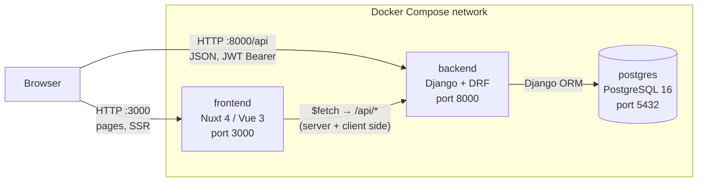
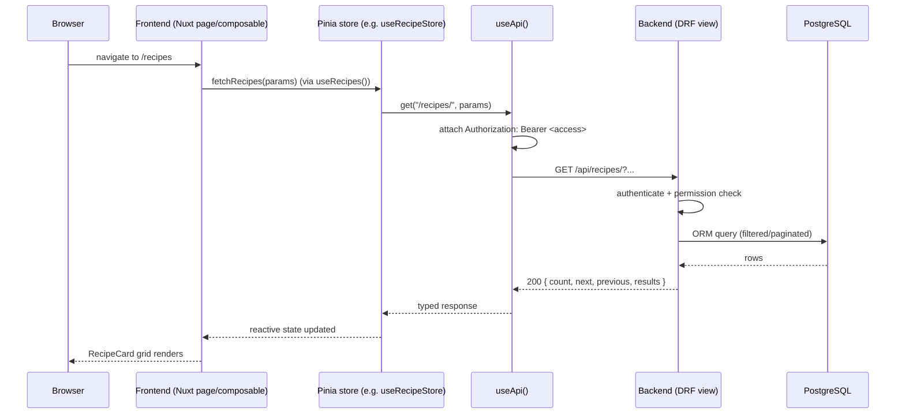

# Architecture

🇬🇧 English | [🇫🇷 Français](architecture.fr.md)

## Summary

- [Overview](#overview)
- [Services](#services)
- [How the pieces communicate](#how-the-pieces-communicate)
- [Request lifecycle](#request-lifecycle)
- [Backend app layout](#backend-app-layout)
- [Frontend layout](#frontend-layout)
- [Dev vs prod](#dev-vs-prod)
- [Where to go next](#where-to-go-next)

This document is the entry point for understanding SUPMEAL's system
architecture: which services exist, how they talk to each other, and where
to look for more detail. For the database schema see
[`docs/database.md`](database.md), for the full HTTP API see
[`docs/api.md`](api.md), for the Microsoft OAuth flow see
[`docs/oauth.md`](oauth.md), and for the frontend's internal structure
(components/composables/stores/pages) see [`docs/frontend.md`](frontend.md).

---

## Overview

SUPMEAL is a recipe / cookbook / meal-planning web app, built as three
containers orchestrated by Docker Compose:

- **`postgres`** - PostgreSQL 16, the single source of truth.
- **`backend`** - Django + Django REST Framework, exposes a JSON API under
  `/api/`.
- **`frontend`** - Nuxt 4 (Vue 3), a server-rendered SPA that consumes that
  API over HTTP.

There is no separate real-time/websocket layer: everything, including the
per-cookbook discussion feature, goes through plain REST calls (see
[How the pieces communicate](#how-the-pieces-communicate)).

## Services

- The **browser talks to both** `frontend` (for pages/SSR) and directly to
  `backend` (for API calls made client-side, since `useApi()` targets
  `runtimeConfig.public.apiUrl` - see [`nuxt.config.ts`](../frontend/nuxt.config.ts)).
- `frontend` can also call `backend` server-side during SSR, using the same
  `apiUrl`.
- `backend` is the only service allowed to reach `postgres`. In prod
  (`docker-compose.prod.yml`) postgres publishes no host port at all, only
  the internal compose network - see [Dev vs prod](#dev-vs-prod).
- Nothing else sits in the request path: no reverse proxy, no message
  queue, no cache layer, no websocket server. Auth is stateless JWT, so any
  backend instance can serve any request.

## How the pieces communicate

**Frontend → Backend: REST over JSON, JWT bearer auth.**

- `frontend/app/composables/useAPI.ts` (`useApi()`) is the single HTTP
  client used everywhere in the frontend: `get/post/put/patch/del` built on
  Nuxt's `$fetch`, base URL from `runtimeConfig.public.apiUrl`.
- It reads the access token from `useToken()` and sets
  `Authorization: Bearer <access>` on every request; `Content-Type` is set
  to `application/json` unless the body is `FormData` (file/image uploads).
- On a `401`, it clears the local session and redirects to `/login`
  client-side - there is no silent refresh-token retry inside `useApi`
  itself (refresh is a separate, explicit call - see
  [`docs/oauth.md`](oauth.md) and [`docs/api.md`](api.md#authentication)).
- No composable or component calls `$fetch`/`fetch` directly against the
  backend outside of `useApi()`, with one deliberate exception:
  `CookbookDiscussionSidebar.vue` also uses `useApi()` directly (not through
  a Pinia store) to hit the nested messaging routes
  (`/cookbooks/{id}/messages/`, `/cookbooks/{id}/recipes/{id}/messages/`,
  `/cookbooks/{id}/plannings/{id}/messages/`) - see
  [`docs/frontend.md`](frontend.md#stores) for why there's no dedicated
  message store yet.
- Everything else goes through a Pinia store (`useRecipeStore`,
  `useCookbookStore`, `usePlanningStore`, `useUserStore`,
  `useImportExportStore`) which wraps `useApi()` calls - full inventory of
  every store action and the endpoint it hits is in
  [`docs/frontend.md`](frontend.md#stores).

**Backend → Database: Django ORM, synchronous, WSGI.**

- `backend/config/wsgi.py` is what actually serves requests (`gunicorn
  config.wsgi:application` in prod, `runserver` in dev, see
  [Dev vs prod](#dev-vs-prod)). `asgi.py` exists (Django's default
  scaffolding) but nothing in the stack runs it - there's no Channels/ASGI
  server in `pyproject.toml`, so there's no websocket support despite the
  file being present.
- Auth is `djangorestframework-simplejwt`: access token 60 min, refresh
  token 7 days. `POST /api/users/logout/` blacklists both. See
  [`docs/api.md`](api.md#authentication) for the full contract.
- OAuth (Microsoft only, today) is handled **entirely server-side** - the
  frontend never sees the client secret, it only forwards an authorization
  `code` to the backend. Full sequence diagram in
  [`docs/oauth.md`](oauth.md#how-the-microsoft-flow-works).

## Request lifecycle

Typical authenticated read (e.g. opening the recipe list), end to end:

If the access token is missing/expired, `useApi()` reacts to the resulting
`401` by clearing the session and redirecting to `/login` (see
[How the pieces communicate](#how-the-pieces-communicate)); refreshing
before that happens is a separate, explicit flow documented in
[`docs/api.md`](api.md#authentication).

## Backend app layout

The backend is split into five Django apps by domain, plus a small
`common` module for cross-cutting helpers (currently just image upload
validation, `backend/common/image_validation.py`). Full model-level detail
is in [`docs/database.md`](database.md#app-layout); the same apps are what
[`docs/api.md`](api.md) is grouped by:

| App | Responsibility | API docs |
| --- | --- | --- |
| `users` | Accounts, JWT auth, Microsoft OAuth | [§1](api.md#1-accounts--authentication-users) |
| `cookbooks` | Cookbooks + sharing | [§2](api.md#2-cookbooks-cookbooks) |
| `recipes` | Recipes, tags, ingredients | [§3](api.md#3-recipes-tags--ingredients-recipes) |
| `planning` | Meal planning | [§4](api.md#4-planning-planning) |
| `messaging` | Per-cookbook/recipe/planning discussion threads | [§5](api.md#5-messaging-messaging) |

`config/` is the Django project itself: `settings.py`, `urls.py` (mounts
each app's router under `/api/`), `wsgi.py`/`asgi.py`. `drf-spectacular`
serves an interactive OpenAPI UI at `/api/docs/` (see
[`docs/api.md`](api.md#interactive-docs)).

## Frontend layout

The frontend is a standard Nuxt 4 app (`frontend/app/`), organized by kind
rather than by feature:

| Folder | Contents |
| --- | --- |
| `pages/` | File-based routes - one page per screen |
| `components/` | Presentational/reusable Vue components, grouped by domain subfolder |
| `composables/` | Reusable reactive logic (`use*.ts`), including page-level "edit view" composables that glue a page to its store |
| `stores/` | Pinia stores - the only place (besides `CookbookDiscussionSidebar.vue`, see above) that calls `useApi()` |
| `layouts/` | `app.vue` (authenticated shell: sidebar + toasts + discussion sidebar) and `empty.vue` (bare) |
| `middleware/` | `auth.global.ts` - route guard run on every navigation, gates authenticated routes and redirects already-logged-in users away from guest-only pages |

A full, cross-linked inventory of every component, composable, store and
page - the "which file do I touch for X" reference - lives in
[`docs/frontend.md`](frontend.md).

## Dev vs prod

Both are plain Docker Compose, no orchestrator, defined side by side at the
repo root:

| | `docker-compose.dev.yml` | `docker-compose.prod.yml` |
| --- | --- | --- |
| Backend server | `manage.py runserver` (autoreload), deps installed via `uv sync` at container start | `gunicorn config.wsgi:application --workers 3`, deps baked into the image at build time |
| Frontend server | `npm run dev -- --host` (HMR) | Image built from `frontend/Dockerfile` (production Nuxt build) |
| Source code | Bind-mounted (`./backend:/app`, `./frontend:/app`) for live editing | Not mounted - code is baked into the image |
| Postgres port | Published to the host (`${POSTGRES_PORT}:5432`), handy for a local DB client | Not published - only reachable from `backend` over the compose network |
| Static files | Served by `runserver` | `collectstatic` runs before `gunicorn` starts |

Both share the same `.env` (via `env_file:`) for `DATABASE_*`,
`BACKEND_PORT`, `FRONTEND_PORT`, `AZURE_*`, etc.

## Where to go next

- New API route or changing a response shape → [`docs/api.md`](api.md)
- New table/column or migration question → [`docs/database.md`](database.md)
- Touching login/register/Microsoft sign-in → [`docs/oauth.md`](oauth.md)
- Which Vue component/composable/store/page to edit → [`docs/frontend.md`](frontend.md)
