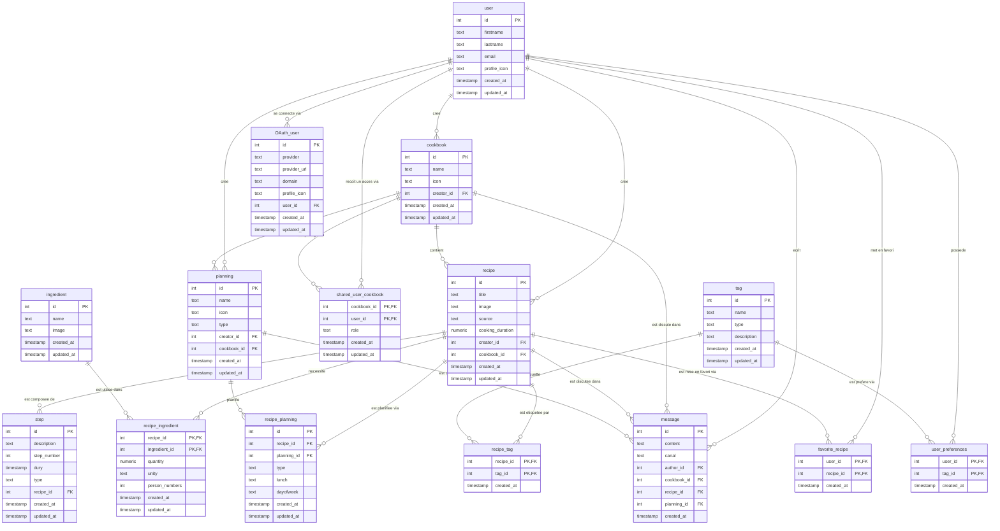

# Base de données

[🇬🇧 English](database.md) | 🇫🇷 Français

## Sommaire

- [Partie 1 - Base de données](#partie-1---base-de-données)
  - [Vue d'ensemble](#vue-densemble)
  - [Diagramme entité-relation](#diagramme-entité-relation)
  - [Tables](#tables)
- [Partie 2 - Modèles Django](#partie-2---modèles-django)
  - [Organisation des apps](#organisation-des-apps)
  - [Correspondance table ↔ modèle](#correspondance-table--modèle)
  - [Modèle utilisateur personnalisé](#modèle-utilisateur-personnalisé)
  - [Clés primaires composites](#clés-primaires-composites)
  - [Exécuter les migrations](#exécuter-les-migrations)
  - [Dépendances circulaires entre apps (piège des clés composites)](#dépendances-circulaires-entre-apps-piège-des-clés-composites)

Ce document est le complément technique du schéma conceptuel disponible dans
[`docs/schema_bdd/`](schema_bdd/). La partie 1 explique ce que représente
chaque table SQL et comment les tables sont reliées entre elles. La partie 2
explique comment ce schéma est implémenté sous forme de modèles Django, et
comment travailler avec les migrations au quotidien.

---

## Partie 1 - Base de données

### Vue d'ensemble

- **Système de base de données :** PostgreSQL 16 (voir `docker-compose.dev.yml`,
  service `postgres`)
- **Domaine :** un gestionnaire de recettes/carnets de cuisine - les
  utilisateurs rédigent des recettes, les organisent en cookbooks partagés,
  planifient des repas et discutent autour de ceux-ci.

### Diagramme entité-relation



### Tables

#### `user`

Le compte d'une personne utilisant l'application. Toutes les autres tables
ayant une notion de « créateur », « auteur » ou « propriétaire » pointent
vers cette table.

| Colonne         | Type      | Contraintes | Note                            |
| --------------- | --------- | ----------- | -------------------------------- |
| `id`            | INTEGER   | PK          |                                  |
| `firstname`     | TEXT      | not null    |                                  |
| `lastname`      | TEXT      | not null    |                                  |
| `email`         | TEXT      | not null    |                                  |
| `password`      | TEXT      | not null    | mot de passe haché (fourni par l'`AbstractUser` de Django) |
| `profile_icon`  | TEXT      | not null, default `''` | optionnel ; chaîne vide si non fourni |
| `created_at`    | TIMESTAMP | not null    |                                  |
| `updated_at`    | TIMESTAMP | not null    |                                  |

#### `OAuth_user`

Un fournisseur d'identité externe (Google, GitHub, ...) lié à un `user`, de
sorte qu'un même compte puisse se connecter via plusieurs fournisseurs.

| Colonne         | Type      | Contraintes | Note                          |
| --------------- | --------- | ----------- | ------------------------------ |
| `id`            | INTEGER   | PK          |                                |
| `provider`      | TEXT      | not null    | ex. "google", "github"         |
| `provider_url`  | TEXT      | not null    |                                |
| `domain`        | TEXT      | not null    |                                |
| `profile_icon`  | TEXT      | null        |                                |
| `user_id`       | INTEGER   | not null    | → `user.id`                    |
| `created_at`    | TIMESTAMP | not null    |                                |
| `updated_at`    | TIMESTAMP | not null    |                                |

#### `cookbook`

Une collection nommée de recettes appartenant à un utilisateur, éventuellement
partagée avec d'autres.

| Colonne       | Type      | Contraintes | Note        |
| ------------- | --------- | ----------- | ------------ |
| `id`          | INTEGER   | PK          |              |
| `name`        | TEXT      | not null    |              |
| `icon`        | TEXT      | null, défaut : icône intégrée | data URI/base64 ; ne fait pas partie du schéma d'origine, ajoutée par-dessus uniquement pour l'affichage |
| `creator_id`  | INTEGER   | not null    | → `user.id`  |
| `created_at`  | TIMESTAMP | not null    |              |
| `updated_at`  | TIMESTAMP | not null    |              |

#### `shared_user_cookbook`

Accorde à un utilisateur l'accès à un cookbook qu'il n'a pas créé, avec un
`role` (niveau de permission). Clé primaire composite : un utilisateur ne
peut recevoir l'accès à un cookbook donné qu'une seule fois.

| Colonne        | Type      | Contraintes | Note              |
| -------------- | --------- | ----------- | ------------------ |
| `cookbook_id`  | INTEGER   | PK          | → `cookbook.id`     |
| `user_id`      | INTEGER   | PK          | → `user.id`         |
| `role`         | TEXT      | not null    |                    |
| `created_at`   | TIMESTAMP | not null    |                    |
| `updated_at`   | TIMESTAMP | not null    |                    |

#### `recipe`

Une recette : titre, source/image optionnelles, et un créateur. `cookbook_id`
est nullable, car une recette peut exister avant d'être rangée dans un
cookbook.

| Colonne             | Type      | Contraintes | Note                    |
| ------------------- | --------- | ----------- | ------------------------ |
| `id`                | INTEGER   | PK          |                          |
| `title`             | TEXT      | not null    |                          |
| `image`             | TEXT      | null        |                          |
| `source`            | TEXT      | null        |                          |
| `cooking_duration`  | NUMERIC   | null        | ex. en minutes           |
| `creator_id`        | INTEGER   | not null    | → `user.id`              |
| `cookbook_id`       | INTEGER   | null        | → `cookbook.id`          |
| `created_at`        | TIMESTAMP | not null    |                          |
| `updated_at`        | TIMESTAMP | not null    |                          |

#### `step`

Une étape ordonnée des instructions d'une recette.

| Colonne        | Type      | Contraintes | Note              |
| -------------- | --------- | ----------- | ------------------ |
| `id`           | INTEGER   | PK          |                    |
| `description`  | TEXT      | not null    |                    |
| `step_number`  | INTEGER   | not null    | ordre au sein de la recette |
| `dury`         | TIMESTAMP | not null    | durée/horaire de l'étape |
| `type`         | TEXT      | not null    | ex. "prep", "cook"  |
| `recipe_id`    | INTEGER   | not null    | → `recipe.id`       |
| `created_at`   | TIMESTAMP | not null    |                    |
| `updated_at`   | TIMESTAMP | not null    |                    |

#### `ingredient`

Un ingrédient réutilisable (ex. « farine », « œuf ») partagé entre les
recettes. La quantité utilisée dans une recette précise n'est pas stockée
ici.

| Colonne       | Type      | Contraintes | Note |
| ------------- | --------- | ----------- | ---- |
| `id`          | INTEGER   | PK          |      |
| `name`        | TEXT      | not null    |      |
| `image`       | TEXT      | null        |      |
| `created_at`  | TIMESTAMP | not null    |      |
| `updated_at`  | TIMESTAMP | not null    |      |

#### `recipe_ingredient`

Table de jointure quantifiant la quantité d'un ingrédient nécessaire à une
recette. Clé primaire composite : une recette ne liste un ingrédient donné
qu'une seule fois.

| Colonne           | Type      | Contraintes | Note                      |
| ----------------- | --------- | ----------- | -------------------------- |
| `recipe_id`       | INTEGER   | PK          | → `recipe.id`               |
| `ingredient_id`   | INTEGER   | PK          | → `ingredient.id`           |
| `quantity`        | NUMERIC   | not null    |                            |
| `unity`           | TEXT      | null        | ex. "g", "mL"              |
| `person_numbers`  | INTEGER   | not null    | quantité prévue pour N personnes |
| `created_at`      | TIMESTAMP | not null    |                            |
| `updated_at`      | TIMESTAMP | not null    |                            |

#### `tag`

Une étiquette servant à catégoriser les recettes (régime, cuisine,
difficulté, ...) ou à exprimer les préférences gustatives d'un utilisateur.

| Colonne         | Type      | Contraintes | Note |
| --------------- | --------- | ----------- | ---- |
| `id`            | INTEGER   | PK          |      |
| `name`          | TEXT      | not null    |      |
| `type`          | TEXT      | not null    |      |
| `description`   | TEXT      | null        |      |
| `created_at`    | TIMESTAMP | not null    |      |
| `updated_at`    | TIMESTAMP | not null    |      |

#### `recipe_tag`

Table de jointure attachant un `tag` à une `recipe`. Clé primaire composite :
une recette ne peut pas porter deux fois la même étiquette.

| Colonne       | Type      | Contraintes | Note          |
| ------------- | --------- | ----------- | -------------- |
| `recipe_id`   | INTEGER   | PK          | → `recipe.id`   |
| `tag_id`      | INTEGER   | PK          | → `tag.id`      |
| `created_at`  | TIMESTAMP | not null    |                |

#### `user_preferences`

Table de jointure enregistrant qu'un utilisateur apprécie/suit une `tag`
donnée (utilisé pour personnaliser les recommandations). Clé primaire
composite.

| Colonne       | Type      | Contraintes | Note        |
| ------------- | --------- | ----------- | ------------ |
| `user_id`     | INTEGER   | PK          | → `user.id`   |
| `tag_id`      | INTEGER   | PK          | → `tag.id`    |
| `created_at`  | TIMESTAMP | not null    |              |

#### `favorite_recipe`

Indique qu'un utilisateur a mis une recette en favori, pour un affichage
personnalisé des recettes (ex. filtre « mes favoris »). Ne fait pas partie
du schéma SQL d'origine - ajoutée par-dessus, sur le même modèle que
`user_preferences` (clé primaire composite, pas de `updated_at`).

| Colonne       | Type      | Contraintes | Note          |
| ------------- | --------- | ----------- | -------------- |
| `user_id`     | INTEGER   | PK          | → `user.id`     |
| `recipe_id`   | INTEGER   | PK          | → `recipe.id`   |
| `created_at`  | TIMESTAMP | not null    |                |

#### `planning`

Un plan de repas nommé, créé par un utilisateur, éventuellement rattaché à un
cookbook. `type` et `icon` ne font pas partie du schéma SQL d'origine,
ajoutés par-dessus : `type` distingue un plan sur une seule journée
(`journalier`, jusqu'à 6 repas - un créneau `lunch` × `type` par jour) d'un
plan couvrant une semaine complète (`hebdomadaire`, jusqu'à 42 repas), et
`icon` reprend le même principe que `cookbook.icon` (affichage uniquement,
icône intégrée par défaut).

| Colonne        | Type      | Contraintes | Note              |
| -------------- | --------- | ----------- | ------------------ |
| `id`           | INTEGER   | PK          |                    |
| `name`         | TEXT      | not null    |                    |
| `icon`         | TEXT      | null, défaut : icône intégrée | data URI/base64 |
| `type`         | TEXT      | not null, défaut `'hebdomadaire'` | `journalier` ou `hebdomadaire` |
| `creator_id`   | INTEGER   | not null    | → `user.id`         |
| `cookbook_id`  | INTEGER   | null        | → `cookbook.id`     |
| `created_at`   | TIMESTAMP | not null    |                    |
| `updated_at`   | TIMESTAMP | not null    |                    |

#### `recipe_planning`

Planifie une `recipe` au sein d'un `planning`, pour un créneau
jour/repas/plat donné. Contrairement aux autres tables de jointure de ce
schéma, elle utilise un `id` de substitution plutôt qu'une clé primaire
composite : la même recette peut être planifiée plusieurs fois dans un
planning (ex. le même dessert plusieurs jours), donc `(recipe_id,
planning_id)` ne peut pas être la clé à elle seule. À la place, une
contrainte d'unicité sur `(planning_id, dayofweek, lunch, type)` garantit au
plus une recette par créneau jour/moment-du-repas/plat.

| Colonne         | Type      | Contraintes | Note                  |
| --------------- | --------- | ----------- | ---------------------- |
| `id`            | INTEGER   | PK          |                        |
| `recipe_id`     | INTEGER   | not null    | → `recipe.id`           |
| `planning_id`   | INTEGER   | not null    | → `planning.id`         |
| `type`          | TEXT      | not null    |                        |
| `lunch`         | TEXT      | not null    |                        |
| `dayofweek`     | TEXT      | null        |                        |
| `created_at`    | TIMESTAMP | not null    |                        |
| `updated_at`    | TIMESTAMP | not null    |                        |

#### `message`

Un message posté par un utilisateur, toujours rattaché à un cookbook.
`recipe_id` et `planning_id` sont tous deux nullables **et mutuellement
exclusifs** (imposé par une contrainte `CHECK`,
`message_not_both_recipe_and_planning`) : un message sans aucun des deux
appartient au canal global du cookbook, un message avec `recipe_id` défini
appartient au canal de cette recette précise, et un message avec
`planning_id` défini appartient au canal de ce planning précis (la
recette/le planning doit lui-même être rangé dans `cookbook_id`). Les
messages n'ont pas de `updated_at` - ils ne peuvent être que postés ou
supprimés, jamais modifiés.

| Colonne        | Type      | Contraintes | Note            |
| -------------- | --------- | ----------- | ---------------- |
| `id`           | INTEGER   | PK          |                  |
| `content`      | TEXT      | not null    |                  |
| `canal`        | TEXT      | not null    | canal de conversation |
| `author_id`    | INTEGER   | not null    | → `user.id`       |
| `cookbook_id`  | INTEGER   | not null    | → `cookbook.id`   |
| `recipe_id`    | INTEGER   | null        | → `recipe.id` ; mutuellement exclusif avec `planning_id` |
| `planning_id`  | INTEGER   | null        | → `planning.id` ; mutuellement exclusif avec `recipe_id` |
| `created_at`   | TIMESTAMP | not null    |                  |

Toutes les clés étrangères sont déclarées `ON UPDATE NO ACTION ON DELETE NO
ACTION` dans le schéma d'origine : une ligne référencée ne peut pas être
supprimée tant que d'autres lignes pointent encore vers elle. Voir la
[partie 2](#modèle-utilisateur-personnalisé) pour la façon dont cela se
traduit dans le comportement `on_delete` de Django.

---

## Partie 2 - Modèles Django

### Organisation des apps

Le schéma ci-dessus est implémenté sous forme de cinq apps Django dans
`backend/`, découpées par domaine plutôt qu'en une seule grosse app :

| App          | Responsabilité                                             |
| ------------ | ------------------------------------------------------------ |
| `users`      | Comptes (`User`, l'`AUTH_USER_MODEL` du projet) et identités OAuth (`OAuthUser`) |
| `cookbooks`  | `Cookbook` et le partage de cookbooks (`SharedUserCookbook`)       |
| `recipes`    | `Recipe` et tout ce qui s'y rattache : `Ingredient`, `Tag`, `Step`, plus les tables de jointure `RecipeIngredient` / `RecipeTag` / `UserPreference` / `FavoriteRecipe` |
| `planning`   | `Planning` et `RecipePlanning`                              |
| `messaging`  | `Message`                                                    |

Ordre des dépendances (qui importe/référence qui) : `users` → `cookbooks` →
`recipes` → `planning` → `messaging` (`messaging.models` importe à la fois
`recipes.models.Recipe` et `planning.models.Planning`, puisqu'un message
peut être rattaché à l'un ou l'autre). `users` elle-même ne dépend de rien
d'autre dans le projet - cela a de l'importance pour les migrations, voir
[plus bas](#dépendances-circulaires-entre-apps-piège-des-clés-composites).

### Correspondance table ↔ modèle

| Table SQL                 | App Django  | Modèle               | Table réelle en base            |
| ------------------------ | ----------- | -------------------- | -------------------------------- |
| `user`                   | `users`     | `User`                | `users_user`                     |
| `OAuth_user`              | `users`     | `OAuthUser`           | `users_oauthuser`                 |
| `cookbook`                | `cookbooks` | `Cookbook`            | `cookbooks_cookbook`              |
| `shared_user_cookbook`    | `cookbooks` | `SharedUserCookbook`  | `cookbooks_sharedusercookbook`    |
| `recipe`                  | `recipes`   | `Recipe`              | `recipes_recipe`                  |
| `ingredient`               | `recipes`   | `Ingredient`          | `recipes_ingredient`              |
| `recipe_ingredient`        | `recipes`   | `RecipeIngredient`    | `recipes_recipeingredient`        |
| `tag`                      | `recipes`   | `Tag`                 | `recipes_tag`                     |
| `recipe_tag`               | `recipes`   | `RecipeTag`           | `recipes_recipetag`               |
| `user_preferences`         | `recipes`   | `UserPreference`      | `recipes_userpreference`          |
| `favorite_recipe`          | `recipes`   | `FavoriteRecipe`      | `recipes_favoriterecipe`          |
| `step`                     | `recipes`   | `Step`                | `recipes_step`                    |
| `planning`                 | `planning`  | `Planning`            | `planning_planning`               |
| `recipe_planning`          | `planning`  | `RecipePlanning`      | `planning_recipeplanning`         |
| `message`                  | `messaging` | `Message`             | `messaging_message`               |

Django crée également ses propres tables de support (`django_migrations`,
`django_content_type`, `django_session`, `django_admin_log`,
`auth_permission`, `auth_group`, ainsi que `users_user_groups` et
`users_user_user_permissions` pour le système de permissions intégré) - il
s'agit d'infrastructure du framework, pas d'éléments du schéma d'origine.

### Modèle utilisateur personnalisé

La table `user` du schéma n'a pas de colonne mot de passe et le projet
utilise django-allauth / dj-rest-auth pour l'authentification, donc
`users.User` étend l'`AbstractUser` de Django (qui fournit déjà `username`,
`password`, les permissions, etc.) et ajoute `email` (unique),
`profile_icon`, `created_at` et `updated_at`. Il est déclaré dans
`config/settings.py` ainsi :

```python
AUTH_USER_MODEL = "users.User"
```

Chaque modèle ayant une clé étrangère « créateur »/« auteur »/« utilisateur »
pointe vers `settings.AUTH_USER_MODEL` plutôt que d'importer `User`
directement, ce qui est la façon standard, en Django, de référencer le
modèle utilisateur actif sans créer de cycle d'import.

Toutes les clés étrangères utilisent `on_delete=models.PROTECT`, ce qui
correspond au `ON DELETE NO ACTION` du schéma : supprimer une ligne encore
référencée ailleurs lève une `ProtectedError` plutôt que de propager la
suppression en cascade ou de mettre silencieusement la référence à `null`.

### Clés primaires composites

La plupart des tables de jointure SQL (`recipe_tag`, `recipe_ingredient`,
`shared_user_cookbook`, `user_preferences`, `favorite_recipe`) utilisent une
clé primaire *composite* (ex. `(recipe_id, tag_id)`) plutôt qu'un `id` de
substitution.
Ceci est implémenté avec `models.CompositePrimaryKey`, natif de Django 6 et
introduit spécifiquement pour ce cas d'usage :

```python
class RecipeTag(models.Model):
    pk = models.CompositePrimaryKey("recipe", "tag")
    recipe = models.ForeignKey(Recipe, on_delete=models.PROTECT, related_name="recipe_tags")
    tag = models.ForeignKey(Tag, on_delete=models.PROTECT, related_name="recipe_tags")
    created_at = models.DateTimeField(auto_now_add=True)
```

Les arguments sont les *noms de champs* du modèle (`"recipe"`, `"tag"`), pas
les noms de colonnes en base (`recipe_id`, `tag_id`).

Une limitation : **l'admin Django ne peut pas encore enregistrer un modèle à
clé primaire composite**. C'est pourquoi `RecipeTag`, `RecipeIngredient`,
`SharedUserCookbook`, `UserPreference` et `FavoriteRecipe` ne sont pas
enregistrés dans le `admin.py` de leur app (voir le commentaire en tête de
chaque fichier). `RecipePlanning` fait exception puisqu'il utilise un `id`
de substitution à la place - voir sa [description de table](#recipe_planning)
ci-dessus pour comprendre pourquoi.

### Exécuter les migrations

Toutes les commandes ci-dessous s'exécutent via `docker-compose.dev.yml`, de
sorte que Postgres et les bonnes versions de Python/Django soient utilisées -
aucun environnement virtuel local n'est nécessaire. Démarrer d'abord la
stack si elle ne tourne pas déjà :

```bash
docker compose -f docker-compose.dev.yml up -d postgres backend
```

**Créer les migrations** après toute modification d'un `models.py` (ceci
inspecte les modèles et écrit les fichiers de migration sous
`<app>/migrations/`) :

```bash
docker compose -f docker-compose.dev.yml run --rm backend \
  uv run python manage.py makemigrations
```

**Appliquer les migrations** à la base de données (ceci exécute réellement
le SQL sur Postgres) :

```bash
docker compose -f docker-compose.dev.yml run --rm backend \
  uv run python manage.py migrate
```

En développement courant, le service `backend` exécute déjà `migrate` à
chaque démarrage du conteneur (voir son `command:` dans
`docker-compose.dev.yml`), donc un simple `docker compose -f
docker-compose.dev.yml up backend` suffit souvent après avoir récupéré de
nouvelles migrations.

**Vérifier les changements de modèles qui n'ont pas encore été transformés
en migration** (utile en CI, ou avant un commit) :

```bash
docker compose -f docker-compose.dev.yml run --rm backend \
  uv run python manage.py makemigrations --check --dry-run
```

**Prévisualiser le SQL qu'une migration va exécuter**, sans l'appliquer :

```bash
docker compose -f docker-compose.dev.yml run --rm backend \
  uv run python manage.py sqlmigrate <app_label> <migration_number>
# ex. uv run python manage.py sqlmigrate recipes 0001
```

**Revenir en arrière** sur une app jusqu'à une migration antérieure :

```bash
docker compose -f docker-compose.dev.yml run --rm backend \
  uv run python manage.py migrate <app_label> <previous_migration_name>
# ex. uv run python manage.py migrate recipes 0001_initial
```

**Exécuter le check système complet de Django** (détecte les problèmes de
configuration au-delà des simples migrations en attente) :

```bash
docker compose -f docker-compose.dev.yml run --rm backend \
  uv run python manage.py check
```

### Dépendances circulaires entre apps (piège des clés composites)

Quand plusieurs *nouvelles* apps avec des clés étrangères inter-apps sont
migrées pour la première fois en un seul appel à `makemigrations`,
l'autodétecteur de migrations de Django peut scinder la migration initiale
de chaque app en deux : une migration `CreateModel` sans les champs
relationnels, suivie d'une seconde migration qui ajoute (`AddField`) les
clés étrangères une fois que les tables de toutes les apps existent. C'est
la façon dont Django garantit un ordre de création valide entre apps, et
c'est sans conséquence pour des clés étrangères normales.

Cela casse en revanche `CompositePrimaryKey` : la clé primaire a besoin que
ses champs de clé étrangère constitutifs existent déjà sur le modèle au
moment du `CreateModel`, puisque la contrainte `PRIMARY KEY` est émise dans
le cadre de l'instruction `CREATE TABLE`. Si les champs FK sont reportés à
une seconde migration, la création de la table échoue.

**Solution de contournement :** lors de la création de plusieurs nouvelles
apps interdépendantes en même temps (ce qui était le cas ici), générer les
migrations **une app à la fois, dans l'ordre des dépendances**, plutôt qu'un
seul `makemigrations` global :

```bash
docker compose -f docker-compose.dev.yml run --rm backend \
  uv run python manage.py makemigrations users
docker compose -f docker-compose.dev.yml run --rm backend \
  uv run python manage.py makemigrations cookbooks
docker compose -f docker-compose.dev.yml run --rm backend \
  uv run python manage.py makemigrations recipes
docker compose -f docker-compose.dev.yml run --rm backend \
  uv run python manage.py makemigrations planning
docker compose -f docker-compose.dev.yml run --rm backend \
  uv run python manage.py makemigrations messaging
```

Chaque app est alors résolue par rapport aux apps dont les tables sont déjà
définies, de sorte que chaque modèle - y compris les tables de jointure à
clé composite - est créé en une seule migration.

Ceci ne concerne que l'**introduction de nouvelles apps** avec des relations
inter-apps. Les modifications courantes des modèles d'une app existante
(ajout d'un champ, ajustement d'un `Meta`, etc.) passent par un
`makemigrations` normal, sans traitement particulier.
