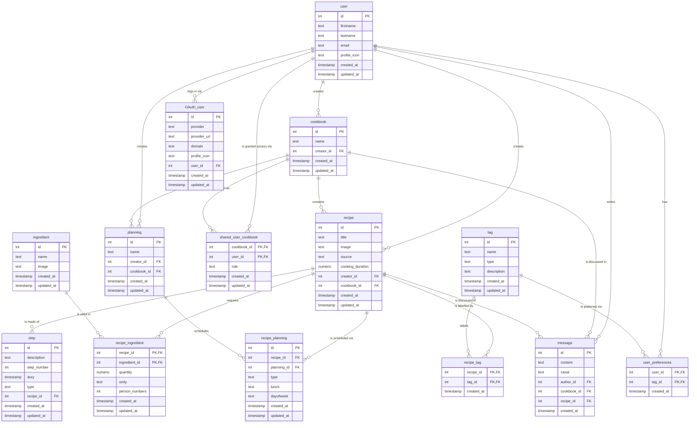

# Database

## Summary

- [Part 1 - Database](#part-1---database)
  - [Overview](#overview)
  - [Entity-Relationship Diagram](#entity-relationship-diagram)
  - [Tables](#tables)
- [Part 2 - Django Models](#part-2---django-models)
  - [App layout](#app-layout)
  - [Table to model mapping](#table-to-model-mapping)
  - [Custom user model](#custom-user-model)
  - [Composite primary keys](#composite-primary-keys)
  - [Running migrations](#running-migrations)
  - [Circular app dependencies (composite PK gotcha)](#circular-app-dependencies-composite-pk-gotcha)

This document is the implementation-facing companion to the conceptual
schema in [`docs/schema_bdd/`](schema_bdd/). Part 1 explains what each SQL
table represents and how tables relate to each other. Part 2 explains how
that schema is implemented as Django models, and how to work with
migrations day to day.

---

## Part 1 - Database

### Overview

- **Database system:** PostgreSQL 16 (see `docker-compose.dev.yml`, service
  `postgres`)
- **Domain:** a recipe/cookbook manager - users write recipes, organize
  them into shared cookbooks, plan meals and chat around them.

### Entity-Relationship Diagram



### Tables

#### `user`

The account of a person using the app. Every other table that has a
"creator", "author" or "owner" concept points back to this table.

| Column          | Type      | Constraints | Note                            |
| --------------- | --------- | ----------- | -------------------------------- |
| `id`            | INTEGER   | PK          |                                  |
| `firstname`     | TEXT      | not null    |                                  |
| `lastname`      | TEXT      | not null    |                                  |
| `email`         | TEXT      | not null    |                                  |
| `password`      | TEXT      | not null    | hashed password (Django's `AbstractUser` provides this) |
| `profile_icon`  | TEXT      | not null, default `''` | optional; empty string when not provided |
| `created_at`    | TIMESTAMP | not null    |                                  |
| `updated_at`    | TIMESTAMP | not null    |                                  |

#### `OAuth_user`

An external identity provider (Google, GitHub, ...) linked to a `user`, so
a single account can sign in through several providers.

| Column          | Type      | Constraints | Note                          |
| --------------- | --------- | ----------- | ------------------------------ |
| `id`            | INTEGER   | PK          |                                |
| `provider`      | TEXT      | not null    | e.g. "google", "github"        |
| `provider_url`  | TEXT      | not null    |                                |
| `domain`        | TEXT      | not null    |                                |
| `profile_icon`  | TEXT      | null        |                                |
| `user_id`       | INTEGER   | not null    | → `user.id`                    |
| `created_at`    | TIMESTAMP | not null    |                                |
| `updated_at`    | TIMESTAMP | not null    |                                |

#### `cookbook`

A named collection of recipes owned by one user, optionally shared with
others.

| Column        | Type      | Constraints | Note        |
| ------------- | --------- | ----------- | ------------ |
| `id`          | INTEGER   | PK          |              |
| `name`        | TEXT      | not null    |              |
| `creator_id`  | INTEGER   | not null    | → `user.id`  |
| `created_at`  | TIMESTAMP | not null    |              |
| `updated_at`  | TIMESTAMP | not null    |              |

#### `shared_user_cookbook`

Grants a user access to a cookbook they didn't create, with a `role`
(permission level). Composite primary key: a user is only ever granted
access to a given cookbook once.

| Column         | Type      | Constraints | Note              |
| -------------- | --------- | ----------- | ------------------ |
| `cookbook_id`  | INTEGER   | PK          | → `cookbook.id`     |
| `user_id`      | INTEGER   | PK          | → `user.id`         |
| `role`         | TEXT      | not null    |                    |
| `created_at`   | TIMESTAMP | not null    |                    |
| `updated_at`   | TIMESTAMP | not null    |                    |

#### `recipe`

A recipe: title, optional source/image, and a creator. `cookbook_id` is
nullable, since a recipe can exist before being filed into a cookbook.

| Column              | Type      | Constraints | Note                    |
| ------------------- | --------- | ----------- | ------------------------ |
| `id`                | INTEGER   | PK          |                          |
| `title`             | TEXT      | not null    |                          |
| `image`             | TEXT      | null        |                          |
| `source`            | TEXT      | null        |                          |
| `cooking_duration`  | NUMERIC   | null        | e.g. minutes             |
| `creator_id`        | INTEGER   | not null    | → `user.id`              |
| `cookbook_id`       | INTEGER   | null        | → `cookbook.id`          |
| `created_at`        | TIMESTAMP | not null    |                          |
| `updated_at`        | TIMESTAMP | not null    |                          |

#### `step`

One ordered instruction step of a recipe.

| Column         | Type      | Constraints | Note              |
| -------------- | --------- | ----------- | ------------------ |
| `id`           | INTEGER   | PK          |                    |
| `description`  | TEXT      | not null    |                    |
| `step_number`  | INTEGER   | not null    | order within recipe |
| `dury`         | TIMESTAMP | not null    | step duration/time |
| `type`         | TEXT      | not null    | e.g. "prep", "cook" |
| `recipe_id`    | INTEGER   | not null    | → `recipe.id`       |
| `created_at`   | TIMESTAMP | not null    |                    |
| `updated_at`   | TIMESTAMP | not null    |                    |

#### `ingredient`

A reusable ingredient (e.g. "flour", "egg") shared across recipes. The
quantity used in a specific recipe is not stored here.

| Column        | Type      | Constraints | Note |
| ------------- | --------- | ----------- | ---- |
| `id`          | INTEGER   | PK          |      |
| `name`        | TEXT      | not null    |      |
| `image`       | TEXT      | null        |      |
| `created_at`  | TIMESTAMP | not null    |      |
| `updated_at`  | TIMESTAMP | not null    |      |

#### `recipe_ingredient`

Join table quantifying how much of an ingredient a recipe needs. Composite
primary key: a recipe lists a given ingredient at most once.

| Column            | Type      | Constraints | Note                      |
| ----------------- | --------- | ----------- | -------------------------- |
| `recipe_id`       | INTEGER   | PK          | → `recipe.id`               |
| `ingredient_id`   | INTEGER   | PK          | → `ingredient.id`           |
| `quantity`        | NUMERIC   | not null    |                            |
| `unity`           | TEXT      | null        | e.g. "g", "mL"             |
| `person_numbers`  | INTEGER   | not null    | quantity is for N people    |
| `created_at`      | TIMESTAMP | not null    |                            |
| `updated_at`      | TIMESTAMP | not null    |                            |

#### `tag`

A label used to categorize recipes (diet, cuisine, difficulty, ...) or
express a user's taste preferences.

| Column          | Type      | Constraints | Note |
| --------------- | --------- | ----------- | ---- |
| `id`            | INTEGER   | PK          |      |
| `name`          | TEXT      | not null    |      |
| `type`          | TEXT      | not null    |      |
| `description`   | TEXT      | null        |      |
| `created_at`    | TIMESTAMP | not null    |      |
| `updated_at`    | TIMESTAMP | not null    |      |

#### `recipe_tag`

Join table attaching a `tag` to a `recipe`. Composite primary key: a recipe
can't carry the same tag twice.

| Column        | Type      | Constraints | Note          |
| ------------- | --------- | ----------- | -------------- |
| `recipe_id`   | INTEGER   | PK          | → `recipe.id`   |
| `tag_id`      | INTEGER   | PK          | → `tag.id`      |
| `created_at`  | TIMESTAMP | not null    |                |

#### `user_preferences`

Join table recording that a user likes/follows a given `tag` (used to
personalize recommendations). Composite primary key.

| Column        | Type      | Constraints | Note        |
| ------------- | --------- | ----------- | ------------ |
| `user_id`     | INTEGER   | PK          | → `user.id`   |
| `tag_id`      | INTEGER   | PK          | → `tag.id`    |
| `created_at`  | TIMESTAMP | not null    |              |

#### `planning`
a corrigé le retour à la ligne manquant en fin de .env.example, et git log confirme que le commit 29137a3
A named meal plan created by a user, optionally scoped to a cookbook.

| Column         | Type      | Constraints | Note              |
| -------------- | --------- | ----------- | ------------------ |
| `id`           | INTEGER   | PK          |                    |
| `name`         | TEXT      | not null    |                    |
| `creator_id`   | INTEGER   | not null    | → `user.id`         |
| `cookbook_id`  | INTEGER   | null        | → `cookbook.id`     |
| `created_at`   | TIMESTAMP | not null    |                    |
| `updated_at`   | TIMESTAMP | not null    |                    |

#### `recipe_planning`

Schedules a `recipe` within a `planning`, for a given day/meal/course slot.
Unlike this schema's other join tables, it uses a surrogate `id` rather
than a composite primary key: the same recipe can be scheduled more than
once in a planning (e.g. the same dessert on several days), so
`(recipe_id, planning_id)` can't be the key on its own. Instead, a unique
constraint on `(planning_id, dayofweek, lunch, type)` keeps at most one
recipe per day/meal-moment/course slot.

| Column          | Type      | Constraints | Note                  |
| --------------- | --------- | ----------- | ---------------------- |
| `id`            | INTEGER   | PK          |                        |
| `recipe_id`     | INTEGER   | not null    | → `recipe.id`           |
| `planning_id`   | INTEGER   | not null    | → `planning.id`         |
| `type`          | TEXT      | not null    |                        |
| `lunch`         | TEXT      | not null    |                        |
| `dayofweek`     | TEXT      | null        |                        |
| `created_at`    | TIMESTAMP | not null    |                        |
| `updated_at`    | TIMESTAMP | not null    |                        |

#### `message`

A chat message posted by a user, always tied to both a cookbook and a
recipe (the conversation context).

| Column         | Type      | Constraints | Note            |
| -------------- | --------- | ----------- | ---------------- |
| `id`           | INTEGER   | PK          |                  |
| `content`      | TEXT      | not null    |                  |
| `canal`        | TEXT      | not null    | conversation channel |
| `author_id`    | INTEGER   | not null    | → `user.id`       |
| `cookbook_id`  | INTEGER   | not null    | → `cookbook.id`   |
| `recipe_id`    | INTEGER   | not null    | → `recipe.id`     |
| `created_at`   | TIMESTAMP | not null    |                  |

All foreign keys are declared `ON UPDATE NO ACTION ON DELETE NO ACTION` in
the original schema: a referenced row cannot be deleted while other rows
still point to it. See [Part 2](#custom-user-model) for how this maps to
Django's `on_delete` behaviour.

---

## Part 2 - Django Models

### App layout

The schema above is implemented as five Django apps under `backend/`,
split by domain rather than as one big app:

| App          | Responsibility                                             |
| ------------ | ------------------------------------------------------------ |
| `users`      | Accounts (`User`, the project's `AUTH_USER_MODEL`) and OAuth identities (`OAuthUser`) |
| `cookbooks`  | `Cookbook` and cookbook sharing (`SharedUserCookbook`)       |
| `recipes`    | `Recipe` and everything attached to it: `Ingredient`, `Tag`, `Step`, plus the `RecipeIngredient` / `RecipeTag` / `UserPreference` join tables |
| `planning`   | `Planning` and `RecipePlanning`                              |
| `messaging`  | `Message`                                                    |

Dependency order (who imports/references whom): `users` → `cookbooks` →
`recipes` → `planning` / `messaging`. `users` itself depends on nothing
else in the project - this matters for migrations, see
[below](#circular-app-dependencies-composite-pk-gotcha).

### Table to model mapping

| SQL table               | Django app  | Model               | Actual DB table                |
| ------------------------ | ----------- | -------------------- | -------------------------------- |
| `user`                   | `users`    a corrigé le retour à la ligne manquant en fin de .env.example, et git log confirme que le commit 29137a3 | `User`                | `users_user`                     |
| `OAuth_user`              | `users`     | `OAuthUser`           | `users_oauthuser`                 |
| `cookbook`                | `cookbooks` | `Cookbook`            | `cookbooks_cookbook`              |
| `shared_user_cookbook`    | `cookbooks` | `SharedUserCookbook`  | `cookbooks_sharedusercookbook`    |
| `recipe`                  | `recipes`   | `Recipe`              | `recipes_recipe`                  |
| `ingredient`               | `recipes`   | `Ingredient`          | `recipes_ingredient`              |
| `recipe_ingredient`        | `recipes`   | `RecipeIngredient`    | `recipes_recipeingredient`        |
| `tag`                      | `recipes`   | `Tag`                 | `recipes_tag`                     |
| `recipe_tag`               | `recipes`   | `RecipeTag`           | `recipes_recipetag`               |
| `user_preferences`         | `recipes`   | `UserPreference`      | `recipes_userpreference`          |
| `step`                     | `recipes`   | `Step`                | `recipes_step`                    |
| `planning`                 | `planning`  | `Planning`            | `planning_planning`               |
| `recipe_planning`          | `planning`  | `RecipePlanning`      | `planning_recipeplanning`         |
| `message`                  | `messaging` | `Message`             | `messaging_message`               |

Django also creates its own supporting tables (`django_migrations`,
`django_content_type`, `django_session`, `django_admin_log`,
`auth_permission`, `auth_group`, plus `users_user_groups` and
`users_user_user_permissions` for the built-in permission system) - these
are framework infrastructure, not part of the original schema.

### Custom user model

The schema's `user` table has no password column and the project uses
django-allauth / dj-rest-auth for authentication, so `users.User` extends
Django's `AbstractUser` (which already provides `username`, `password`,
permissions, etc.) and adds `email` (unique), `profile_icon`, `created_at`
and `updated_at`. It is registered in `config/settings.py` as:

```python
AUTH_USER_MODEL = "users.User"
```

Every model with a "creator"/"author"/"user" foreign key points to
`settings.AUTH_USER_MODEL` rather than importing `User` directly, which is
the standard Django way to reference the active user model without
creating an import cycle.

All foreign keys use `on_delete=models.PROTECT`, matching the schema's
`ON DELETE NO ACTION`: deleting a row that is still referenced elsewhere
raises `ProtectedError` instead of cascading or silently nulling the
reference.

### Composite primary keys

Most SQL join tables (`recipe_tag`, `recipe_ingredient`,
`shared_user_cookbook`, `user_preferences`) use a *composite* primary key
(e.g. `(recipe_id, tag_id)`) rather than a surrogate `id`. This is
implemented with Django 6's native `models.CompositePrimaryKey`,
introduced specifically for this use case:

```python
class RecipeTag(models.Model):
    pk = models.CompositePrimaryKey("recipe", "tag")
    recipe = models.ForeignKey(Recipe, on_delete=models.PROTECT, related_name="recipe_tags")
    tag = models.ForeignKey(Tag, on_delete=models.PROTECT, related_name="recipe_tags")
    created_at = models.DateTimeField(auto_now_add=True)
```

The arguments are the *field names* of the model (`"recipe"`, `"tag"`),
not the DB column names (`recipe_id`, `tag_id`).

One limitation: **the Django admin cannot register a model with a
composite primary key yet**. That's why `RecipeTag`, `RecipeIngredient`,
`SharedUserCookbook` and `UserPreference` are not registered in their
app's `admin.py` (see the comment at the top of each file).
`RecipePlanning` is exempt since it uses a surrogate `id` instead - see
its [table description](#recipe_planning) above for why.

### Running migrations

All commands below run through `docker-compose.dev.yml`, so Postgres and
the correct Python/Django versions are used - no local virtualenv needed.
Start the stack first if it isn't already running:

```bash
docker compose -f docker-compose.dev.yml up -d postgres backend
```

**Create migrations** after changing any `models.py` (this inspects the
models and writes migration files under `<app>/migrations/`):

```bash
docker compose -f docker-compose.dev.yml run --rm backend \
  uv run python manage.py makemigrations
```

**Apply migrations** to the database (this actually runs the SQL against
Postgres):

```bash
docker compose -f docker-compose.dev.yml run --rm backend \
  uv run python manage.py migrate
```

In normal day-to-day development the `backend` service already runs
`migrate` on every container start (see its `command:` in
`docker-compose.dev.yml`), so a plain `docker compose -f
docker-compose.dev.yml up backend` is often enough after pulling new
migrations.

**Check for model changes that haven't been turned into a migration yet**
(useful in CI, or before committing):

```bash
docker compose -f docker-compose.dev.yml run --rm backend \
  uv run python manage.py makemigrations --check --dry-run
```

**Preview the SQL a migration will run**, without applying it:

```bash
docker compose -f docker-compose.dev.yml run --rm backend \
  uv run python manage.py sqlmigrate <app_label> <migration_number>
# e.g. uv run python manage.py sqlmigrate recipes 0001
```

**Roll back** an app to an earlier migration:

```bash
docker compose -f docker-compose.dev.yml run --rm backend \
  uv run python manage.py migrate <app_label> <previous_migration_name>
# e.g. uv run python manage.py migrate recipes 0001_initial
```

**Run the full Django system check** (catches misconfigurations beyond
just pending migrations):

```bash
docker compose -f docker-compose.dev.yml run --rm backend \
  uv run python manage.py check
```

### Circular app dependencies (composite PK gotcha)

When several *new* apps with cross-app foreign keys are migrated for the
first time in a single `makemigrations` call, Django's migration
autodetector can split each app's initial migration in two: one
`CreateModel` migration without the relational fields, followed by a
second migration that `AddField`s the foreign keys once every app's tables
exist. This is Django's way of guaranteeing a valid creation order across
apps, and is harmless for normal foreign keys.

It breaks `CompositePrimaryKey`, though: the primary key needs its
constituent foreign key fields to already exist on the model at
`CreateModel` time, since the `PRIMARY KEY` constraint is emitted as part
of the `CREATE TABLE` statement. If the FK fields are deferred to a second
migration, table creation fails.

**Workaround:** when creating several new interdependent apps at once (as
was the case here), generate migrations **one app at a time, in dependency
order**, instead of a single `makemigrations` for everything:

```bash
docker compose -f docker-compose.dev.yml run --rm backend \
  uv run python manage.py makemigrations users
docker compose -f docker-compose.dev.yml run --rm backend \
  uv run python manage.py makemigrations cookbooks
docker compose -f docker-compose.dev.yml run --rm backend \
  uv run python manage.py makemigrations recipes
docker compose -f docker-compose.dev.yml run --rm backend \
  uv run python manage.py makemigrations planning
docker compose -f docker-compose.dev.yml run --rm backend \
  uv run python manage.py makemigrations messaging
```

Each app is then resolved against apps that already have their tables
defined, so every model - including the composite-PK join tables - is
created in a single migration.

This only matters when **introducing new apps** with cross-app relations.
Day-to-day changes to an existing app's models (adding a field, tweaking a
`Meta`, etc.) go through a normal, single `makemigrations` call without
any special handling.
