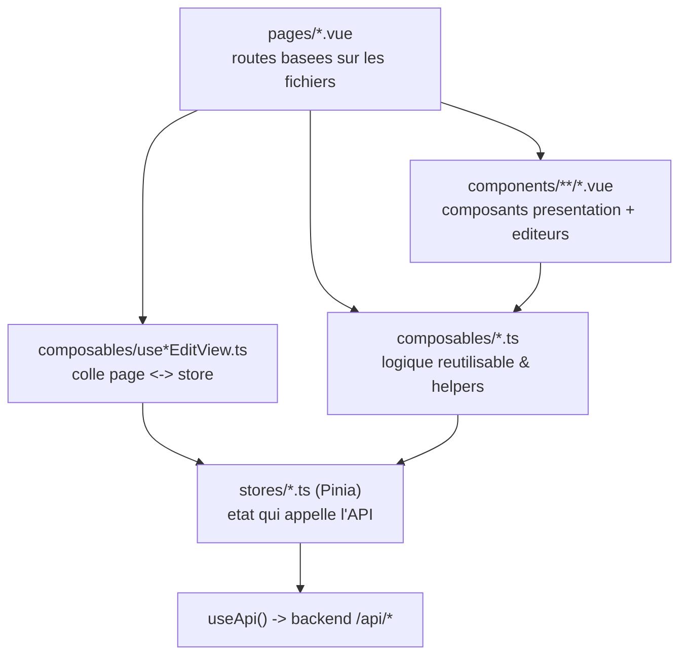

# Frontend

[🇬🇧 English](frontend.md) | 🇫🇷 Français

## Sommaire

- [Vue d'ensemble](#vue-densemble)
- [Composants](#composants)
  - [Branding & boutons](#branding--boutons)
  - [Commun](#commun)
  - [Cookbook](#cookbook)
  - [Formulaires](#formulaires)
  - [Import / export](#import--export)
  - [Layout](#layout)
  - [Planning](#planning)
  - [Recettes](#recettes)
  - [Recherche](#recherche)
  - [Paramètres](#paramètres)
  - [Icônes](#icônes)
- [Stores](#stores)
- [Composables](#composables)
- [Pages principales](#pages-principales)

Ce document est la référence « quel fichier toucher pour X » du frontend
Nuxt 4 / Vue 3 (`frontend/app/`). Il est découpé comme demandé, dans l'ordre
des dépendances : **composants** (ce qui s'affiche), **stores** (ce qui
appelle l'API), **composables** (la logique qui relie les deux), puis
**pages principales** (ce qui utilise tout ça). Chaque nom est relié par un
lien interne vers sa propre définition ailleurs dans ce document, pour
passer directement d'une page à l'action de store qu'elle déclenche.

Pour la vue système (comment le frontend parle au backend, dev vs prod,
etc.), voir [`docs/architecture.md`](architecture.fr.md).

---

## Vue d'ensemble

La plupart des pages sont fines : une page sous `recipes/`, `cookbooks/`
ou `planning/` se contente en général d'afficher un composant `*Editor.vue`
et laisse un composable `use*EditView.ts` correspondant (ex.
[`useRecipesEditView`](#userecipeseditview)) gérer l'état du formulaire, la
validation et les appels au store. Les pages de lecture/liste appellent un
composable de domaine (ex. [`useRecipes`](#userecipes)) qui encapsule le
store correspondant. Voir [Pages principales](#pages-principales) pour le
détail complet.

---

## Composants

Regroupés par sous-dossier de `frontend/app/components/`. La ligne
**Dépend de** sous chaque tableau liste les composables/stores/composants
enfants utilisés directement, reliés à leur propre section plus bas -
c'est le moyen le plus rapide de savoir ce qui casse si on change le
format de retour d'un composable.

Le dossier `icons/` (~35 SVG triviaux à un seul glyphe) est condensé dans
une liste unique à la [fin](#icônes) plutôt qu'une ligne par icône.

### Branding & boutons

| Composant | Objectif | Props | Emits | Slots |
| --- | --- | --- | --- | --- |
| `AppLogo.vue` | Logo SUPMEAL avec un slogan/légende optionnel en dessous | `tagline?: string`; `size?: "sm"\|"md"\|"lg"` (défaut `"md"`) | - | - |
| `buttons/AppButton.vue` | Bouton/lien générique stylé - rend un `<button>` ou un `NuxtLink` selon que `to` est défini | `variant?: "primary"\|"secondary"\|"destructive"\|"ghost"\|"oauth"` (défaut `"primary"`); `size?: "sm"\|"md"\|"lg"`; `type?: "button"\|"submit"\|"reset"`; `disabled?: boolean`; `block?: boolean`; `to?: string` | - | `icon` (icône de tête); défaut (label/contenu) |
| `buttons/OAuthButtons.vue` | Boutons de connexion Google (désactivé, « bientôt ») et Microsoft OAuth ; démarre le flux Microsoft au clic | - | - | - |

- `OAuthButtons.vue` - Composables : [useOAuth](#useoauth). Enfants : [AppButton](#appbutton), icônes.

### Commun

| Composant | Objectif | Props | Emits | Slots |
| --- | --- | --- | --- | --- |
| `common/ConfirmModal.vue` | Modale de confirmation générique (téléportée dans le body) ; peut exiger un mot tapé et/ou une case à cocher | `open: boolean`; `title: string`; `message: string`; `confirmLabel?: string` (défaut `"Confirmer"`); `cancelLabel?: string` (défaut `"Annuler"`); `variant?: "default"\|"destructive"`; `typedWord?: string`; `checkboxLabel?: string` | `close: []`; `confirm: []` | - |
| `common/Pagination.vue` | Pagination numérotée, boutons préc/suiv + fenêtre de numéros (max 5) | `currentPage: number`; `totalPages: number` | `update:currentPage: [page: number]` | - |
| `common/ToastContainer.vue` | Affiche les notifications toast globales (succès/avertissement/erreur), téléportées dans le body | - | - | - |

- `ToastContainer.vue` - Stores : [useToastStore](#usetoaststore). Rendu une seule fois, depuis `layouts/app.vue`.
- Utilisé par la plupart des composants d'édition/liste pour la confirmation d'action destructive ([DeleteCookbookModal](#deletecookbookmodal), [DeletePlanningModal](#deleteplanningmodal), [DeleteRecipeModal](#deleterecipemodal) sont des enveloppes fines du même patron que `ConfirmModal`, avec un texte propre à leur domaine).

### Cookbook

| Composant | Objectif | Props | Emits | Slots |
| --- | --- | --- | --- | --- |
| `cookbook/AssignCookbookMenu.vue` | Liste déroulante des cookbooks dont l'utilisateur est créateur, pour réassigner une recette/planning vers un autre | `currentCookbookId?: number \| null` | `select: [cookbook: { id: number; name: string }]` | - |
| `cookbook/CookbookCard.vue` | Carte de grille pour un cookbook personnel : icône, nom, compteurs recettes/plannings, date de màj, menu « ... » (voir/éditer/supprimer) | `cookbook: Cookbook`; `to: string`; `showMenu?: boolean` (défaut `true`) | - | - |
| `cookbook/CookbookDiscussionSidebar.vue` | Barre latérale droite (rendue depuis `layouts/app.vue`) avec une discussion par cookbook : sélecteur de canal (général/recette/planning), messages, envoi/suppression | `cookbookId: number`; `defaultChannel: CookbookDiscussionDefault` | - | - |
| `cookbook/CookbookEditor.vue` | Formulaire de création/édition d'un cookbook : nom, upload d'icône, sauvegarde/suppression, retour | `mode: "create" \| "edit"`; `cookbookId?: number` | - | - |
| `cookbook/CookbookMembersPanel.vue` | Liste le créateur + les membres partagés ; le propriétaire peut inviter par email, changer un rôle, ou retirer l'accès | `cookbookId: number`; `creator`; `sharedWith: SharedUserCookbook[]`; `isOwner: boolean` | - | - |
| `cookbook/DeleteCookbookModal.vue` | Modale de confirmation destructive pour supprimer un cookbook ; peut conserver ses recettes/plannings en tant que personnels, verrouillée derrière la saisie de « suppression » | `open: boolean`; `cookbookName: string`; `recipes?: {id,title}[]`; `plannings?: {id,name}[]` | `close: []`; `confirm: [options: { keepRecipes: boolean; keepPlannings: boolean }]` | - |
| `cookbook/SharedCookbookCard.vue` | Carte-ligne compacte pour un cookbook partagé avec l'utilisateur courant : icône, nom, propriétaire, activité, badge de rôle | `cookbook: Cookbook`; `role: Exclude<CookbookRole,"admin">`; `to: string`; `activityAt?: string` | - | - |

- `AssignCookbookMenu.vue` - Stores : [useCookbookStore](#usecookbookstore). Composables : [useAuth](#useauth), `hasCookbookRank` ([useCookbooks](#usecookbooks)).
- `CookbookCard.vue` - Composables : [useRecipes](#userecipes) (`relativeTime`), [useCookbooksEditView](#usecookbookseditview) (`deleteCookbookWithOptions`). Stores : [useToastStore](#usetoaststore). Enfants : [DeleteCookbookModal](#deletecookbookmodal).
- `CookbookDiscussionSidebar.vue` - **Appelle [useApi](#useapi) directement**, pas via un store, sur les routes de messagerie imbriquées (`/cookbooks/{id}/messages/`, `.../recipes/{id}/messages/`, `.../plannings/{id}/messages/`) - voir [`stores/cookbooks/useMessageStore.ts`](#usemessagestore-vide) pour comprendre pourquoi. Utilise aussi [useAuth](#useauth), [useCookbooks](#usecookbooks). Stores : [useCookbookStore](#usecookbookstore), [useToastStore](#usetoaststore).
- `CookbookEditor.vue` - Composables : [useCookbooksEditView](#usecookbookseditview) (`useCookbookEditForm`), [useGoBack](#usegoback). Enfants : [DeleteCookbookModal](#deletecookbookmodal).
- `CookbookMembersPanel.vue` - Stores : [useCookbookStore](#usecookbookstore), [useToastStore](#usetoaststore). Composables : [useCookbooks](#usecookbooks) (`COOKBOOK_ROLE_LABELS`).
- `SharedCookbookCard.vue` - Composables : [useCookbooks](#usecookbooks) (`COOKBOOK_ROLE_LABELS`), [useRecipes](#userecipes) (`relativeTime`).

Utilisé par : [`pages/cookbooks/index.vue`](#pages-principales), [`.../new.vue`](#pages-principales), [`.../[id]/view.vue`](#pages-principales), [`.../[id]/edit.vue`](#pages-principales), ainsi que `CookbookCard`/`SharedCookbookCard` sur [`pages/home.vue`](#pages-principales) et [`pages/sharedwithme.vue`](#pages-principales).

### Formulaires

| Composant | Objectif | Props | Emits | Slots |
| --- | --- | --- | --- | --- |
| `forms/AppInput.vue` | Champ texte avec label, slot d'icône de tête optionnel, texte d'erreur/aide, bascule intégrée afficher/masquer pour `type="password"` | `modelValue?: string`; `id: string`; `label?: string`; `type?: string` (défaut `"text"`); `placeholder?: string`; `autocomplete?: string`; `hint?: string`; `error?: string` | `update:modelValue: [value: string]` | `icon` (icône de tête) |

- Utilisé sur tous les formulaires d'auth/paramètres : [`pages/login.vue`](#pages-principales), [`register.vue`](#pages-principales), [`settings.vue`](#pages-principales).

### Import / export

| Composant | Objectif | Props | Emits | Slots |
| --- | --- | --- | --- | --- |
| `import_export/ExportSelectionList.vue` | Liste à cocher multi-sélection, recherchable et paginée (recettes/cookbooks/plannings) avec « tout sélectionner (filtré) » + bouton export | `items: SelectableItem[]`; `loading?: boolean`; `exporting?: boolean`; `emptyLabel?: string`; `searchPlaceholder?: string` | `export: [ids: number[]]` | - |
| `import_export/ImportDropzone.vue` | Zone de glisser-déposer (ou parcourir) pour un fichier `.json` unique, avec aperçu/effacement et bouton d'import ; expose `clearFile()` | `label: string`; `busy?: boolean` | `import: [file: File]` | - |

- `ExportSelectionList.vue` - Utilise le type `SelectableItem` de [useImportExport](#useimportexport). Enfants : [Pagination](#pagination).
- `ImportDropzone.vue` - Composables : [useImportExport](#useimportexport) (`isJsonFile`), VueUse `useDropZone`. Stores : [useToastStore](#usetoaststore).
- Les deux sont utilisés exclusivement par [`pages/import_export.vue`](#pages-principales).

### Layout

| Composant | Objectif | Props | Emits | Slots |
| --- | --- | --- | --- | --- |
| `layout/AppSidebar.vue` | Barre latérale gauche fixe : avatar, logo, nav principale (accueil/recettes/cookbooks/partagés/planning/recherche/import-export), nom d'utilisateur, paramètres, déconnexion | - | - | - |

- Composables : [useAuth](#useauth). Rendu une seule fois, depuis `layouts/app.vue` (voir [Pages principales](#pages-principales) pour les pages utilisant ce layout).

### Planning

| Composant | Objectif | Props | Emits | Slots |
| --- | --- | --- | --- | --- |
| `planning/DeletePlanningModal.vue` | Modale de confirmation destructive pour supprimer un planning, verrouillée derrière la saisie de « suppression » | `open: boolean`; `planningName: string` | `close: []`; `confirm: []` | - |
| `planning/MealPlanEditor.vue` | Grille éditable de plan de repas (moment x plat x jour) ; chaque cellule est un [RecipePicker](#recipepicker) | `type: PlanningType`; `slots: MealSlot[]`; `recipes?: Recipe[]` | `update-slot: [key: string, pick: RecipePick]` | - |
| `planning/PlanningCard.vue` | Carte de liste pour un planning : icône, nom, type/nb repas/date de màj, menu « ... » (voir/éditer/réassigner cookbook/supprimer) | `planning: Planning`; `to: string`; `canEdit?/canManage?/canReassignCookbook?: boolean` (défaut `true`); `showMenu?: boolean` | - | - |
| `planning/PlanningEditor.vue` | Formulaire de création/édition d'un planning : nom, icône, sélecteur de type (création uniquement), badge cookbook, grille de repas | `mode: "create" \| "edit"`; `planningId?: number` | - | - |
| `planning/PlanningMealsGrid.vue` | Grille de plan de repas en lecture seule, recettes planifiées sous forme de liens, pour visualiser un planning existant | `type: PlanningType`; `meals: PlanningMeal[]` | - | - |
| `planning/RecipePicker.vue` | Autocomplétion de recette pour une cellule (`v-model`), utilisée dans [MealPlanEditor](#mealplaneditor) ; recherche parmi les recettes de l'utilisateur, ou filtre une liste `recipes` fixe quand scopé à un cookbook | `expanded?: boolean`; `recipes?: Recipe[]`; modèle : `defineModel<RecipePick>` | `update:modelValue` (implicite) | - |

- `MealPlanEditor.vue` - Composables : [usePlanning](#useplanning) (`DAYS_OF_WEEK`/`MEAL_MOMENTS`/`MEAL_COURSES`/`DAILY_PLANNING_DAY`). Enfants : [RecipePicker](#recipepicker).
- `PlanningCard.vue` - Stores : [usePlanningStore](#useplanningstore), [useToastStore](#usetoaststore). Composables : [useRecipes](#userecipes) (`relativeTime`), [usePlanning](#useplanning) (`PLANNING_TYPE_LABELS`). Enfants : [DeletePlanningModal](#deleteplanningmodal), [AssignCookbookMenu](#assigncookbookmenu).
- `PlanningEditor.vue` - Composables : [usePlanningEditView](#useplanningeditview) (`usePlanningEditForm`), [usePlanning](#useplanning), [useGoBack](#usegoback). Enfants : [MealPlanEditor](#mealplaneditor), [DeletePlanningModal](#deleteplanningmodal).
- `PlanningMealsGrid.vue` - Composables : [usePlanning](#useplanning) (constantes + `mealsByDayAndSlot`).
- `RecipePicker.vue` - Composables : [useRecipes](#userecipes) (`searchMyRecipes`).

Utilisé par : [`pages/planning/index.vue`](#pages-principales), `new.vue`, `[id]/view.vue`, `[id]/edit.vue`.

### Recettes

| Composant | Objectif | Props | Emits | Slots |
| --- | --- | --- | --- | --- |
| `recipes/DeleteRecipeModal.vue` | Modale de confirmation destructive pour supprimer une recette ; avertit si utilisée dans des plannings, verrouillée derrière la saisie de « suppression » | `open: boolean`; `recipeTitle: string`; `usedInPlannings?: PlanningUsage[]` | `close: []`; `confirm: []` | - |
| `recipes/IngredientRow.vue` | Ligne d'ingrédient unique : nom avec autocomplétion sur le catalogue, quantité/unité/nb de personnes, upload d'image, avertissement de doublon, suppression | `isDuplicate?: boolean`; `excludeIngredientIds?: number[]`; modèle : `defineModel<IngredientLine>` | `update:modelValue` (implicite); `remove: []` | - |
| `recipes/IngredientsPanel.vue` | Enveloppe une liste de [IngredientRow](#ingredientrow), bouton « ajouter un ingrédient », champ portions par défaut | modèle : `defineModel<IngredientLine[]>` | `update:modelValue` (implicite) | - |
| `recipes/RecipeCard.vue` | Carte de grille pour une recette : image, titre, bascule tags, bascule favori, menu « ... » (voir/éditer/réassigner cookbook/supprimer) | `recipe: Recipe`; `to: string`; `canEdit?/canManage?/canReassignCookbook?: boolean`; `showMenu?: boolean` | - | - |
| `recipes/RecipeEditor.vue` | Formulaire de création/édition d'une recette : titre, image, source, durée de cuisson, étapes, ingrédients, tags, sauvegarde/suppression | `mode: "create" \| "edit"`; `recipeId?: number` | - | - |
| `recipes/StepEditor.vue` | Éditeur d'une étape de recette : éditeur WYSIWYG Tiptap (gras/italique/liste à puces) sérialisé en markdown, sélecteur de type (préparation/cuisson), durée, réordonner/supprimer | `index: number`; `total: number`; modèle : `defineModel<StepLine>` | `update:modelValue` (implicite); `remove: []`; `move-up: []`; `move-down: []` | - |
| `recipes/TagsPanel.vue` | Ajouter/retirer les tags d'une recette : filtre par type (repas/régime), recherche-et-choix parmi les tags existants, ou création d'un nouveau | modèle : `defineModel<TagLine[]>` | `update:modelValue` (implicite) | - |

- `DeleteRecipeModal.vue` - pas de dépendance notable en dehors des icônes.
- `IngredientRow.vue` - Stores : [useRecipeStore](#userecipestore). Composables : [useRecipes](#userecipes) (`fileToDataUrl`).
- `IngredientsPanel.vue` - Composables : [useRecipes](#userecipes) (`emptyIngredientLine`). Enfants : [IngredientRow](#ingredientrow).
- `RecipeCard.vue` - Stores : [useRecipeStore](#userecipestore), [useToastStore](#usetoaststore). Composables : [useRecipes](#userecipes), [useCookbooks](#usecookbooks) (`useCookbookName`). Enfants : [DeleteRecipeModal](#deleterecipemodal), [AssignCookbookMenu](#assigncookbookmenu).
- `RecipeEditor.vue` - Composables : [useRecipesEditView](#userecipeseditview) (`useRecipeEditForm`), [useGoBack](#usegoback). Enfants : [StepEditor](#stepeditor), [IngredientsPanel](#ingredientspanel), [TagsPanel](#tagspanel), [DeleteRecipeModal](#deleterecipemodal).
- `StepEditor.vue` - Tiers : `@tiptap/vue-3`, `@tiptap/starter-kit`, `@tiptap/extension-placeholder`, `tiptap-markdown`.
- `TagsPanel.vue` - Stores : [useRecipeStore](#userecipestore). Composables : [useRecipes](#userecipes) (`uid`, `capitalizeFirst`).

Utilisé par : [`pages/new.vue`](#pages-principales), [`pages/recipes/index.vue`](#pages-principales), `[id]/view.vue`, `[id]/edit.vue`.

### Recherche

| Composant | Objectif | Props | Emits | Slots |
| --- | --- | --- | --- | --- |
| `search/CatalogMultiSelect.vue` | Multi-sélection déroulante sur un catalogue recherché côté serveur (tags/ingrédients), liée à une chaîne séparée par virgules ; les éléments sélectionnés s'affichent en puces amovibles | `label: string`; `searchPlaceholder?: string`; `emptyLabel?: string`; `fetchOptions: (search: string) => Promise<{id,name,image?}[]>`; `capitalizeLabels?: boolean`; modèle : `defineModel<string>` | `update:modelValue` (implicite) | - |
| `search/CookbookSearchResults.vue` | Grille de [CookbookCard](#cookbookcard) (squelettes de chargement / état vide / résultats) | `cookbooks: Cookbook[]`; `isLoading: boolean` | - | - |
| `search/PlanningSearchResults.vue` | Grille de [PlanningCard](#planningcard) (squelettes de chargement / état vide / résultats) | `plannings: Planning[]`; `isLoading: boolean` | - | - |
| `search/RecipeSearchResults.vue` | Grille de [RecipeCard](#recipecard) (squelettes de chargement / état vide / résultats) | `recipes: Recipe[]`; `isLoading: boolean` | - | - |
| `search/SearchFilters.vue` | Panneau de filtres dont les champs changent selon `type` (recettes/plannings/cookbooks) : nom, ingrédients/tags, scope cookbook/planning, favoris, plages de temps préparation/cuisson, boutons réinitialiser/rechercher | `type: SearchType`; `showCookbookScope?: boolean`; modèles : `recipeFilters`, `planningFilters`, `cookbookFilters` | `search: []`; `reset: []` | - |

- `CatalogMultiSelect.vue` - Composables : [useRecipes](#userecipes) (`capitalizeFirst`), VueUse `onClickOutside`.
- `SearchFilters.vue` - Stores : [useRecipeStore](#userecipestore). Composables : [usePlanning](#useplanning) (`PLANNING_TYPE_LABELS`). Enfants : [CatalogMultiSelect](#catalogmultiselect).

Utilisé par : [`pages/search.vue`](#pages-principales) (les quatre) et [`pages/cookbooks/[id]/view.vue`](#pages-principales) (`SearchFilters` seul, filtrant les onglets propres à un cookbook).

### Paramètres

| Composant | Objectif | Props | Emits | Slots |
| --- | --- | --- | --- | --- |
| `settings/CuisinePreferencesPanel.vue` | Gère les préférences de cuisine/tags préférés de l'utilisateur : préférences actuelles en puces amovibles, recherche-et-bascule sur le catalogue de tags | - | - | - |

- Stores : [useRecipeStore](#userecipestore). Composables : [useCuisinePreferences](#usecuisinepreferences), [useRecipes](#userecipes) (`capitalizeFirst`).
- Utilisé par [`pages/settings.vue`](#pages-principales).

### Icônes

Les ~35 fichiers sous `components/icons/` sont des SVG triviaux à un seul
glyphe partageant une seule prop : `size?: "xs" | "sm" | "md" | "lg"`
(défaut `"md"`).

`IconAlertTriangle`, `IconBold`, `IconBookmark` (+`filled?: boolean`),
`IconCalendar`, `IconCamera`, `IconCheck`, `IconChevron`
(+`direction?: "up"|"down"|"left"|"right"`, défaut `"down"`),
`IconChevronLeft`, `IconClock`, `IconClose`, `IconCookbook`, `IconDots`,
`IconDownload`, `IconEdit`, `IconEye`, `IconEyeOff`, `IconGoogle`,
`IconHome`, `IconImportExport`, `IconItalic`, `IconListBullet`,
`IconLogout`, `IconMail`, `IconMicrosoft`, `IconPlus`, `IconRecipe`,
`IconSave`, `IconSearch`, `IconSend`, `IconSettings`, `IconShared`,
`IconStar`, `IconTag`, `IconTrash`, `IconUpload`, `IconUser`.

---

## Stores

Chaque store Pinia, et **chaque endpoint backend qu'il appelle** - c'est la
liste à vérifier avant de supposer « il y a sûrement déjà une méthode de
store pour ça », ou avant d'ajouter un nouvel appel API (ajoutez-le ici,
n'appelez pas `useApi()` depuis un composant - voir l'unique exception
volontaire dans [`CookbookDiscussionSidebar`](#cookbookdiscussionsidebar)).
Tous les endpoints sont relatifs à `/api/` ; le contrat complet
(paramètres, format de réponse, codes de statut) est dans
[`docs/api.md`](api.fr.md).

### `useCookbookStore`

Id : `"cookbooks"`. Possède l'état liste/détail des cookbooks, le partage, et un cache de noms.
État : `cookbooks`, `currentCookbook`, `cookbookNames` (id -> nom, cache), `pagination`, `loading`, `error`.

| Action | Méthode & endpoint | Objectif |
| --- | --- | --- |
| `fetchCookbooks(params)` | `GET /cookbooks/` | Lister/paginer les cookbooks (`name`, `shared_with_me`, `page`, `page_size`) |
| `fetchCookbook(id)` | `GET /cookbooks/{id}/` | Charger le détail complet d'un cookbook |
| `createCookbook(payload)` | `POST /cookbooks/` | Créer un cookbook |
| `updateCookbook(id, payload)` | `PATCH /cookbooks/{id}/` | Mettre à jour nom/icône |
| `deleteCookbook(id)` | `DELETE /cookbooks/{id}/` | Supprimer un cookbook |
| `shareCookbook(id, shares)` | `POST /cookbooks/{id}/share/` | Ajouter/mettre à jour des membres partagés et leurs rôles |
| `unshareCookbook(id, userIds)` | `POST /cookbooks/{id}/unshare/` | Retirer des membres partagés |
| `fetchCookbookName(id)` | `GET /cookbooks/{id}/` (mis en cache) | Résoudre juste le nom d'un cookbook (labels type fil d'Ariane) |

Utilisé via [useCookbooks](#usecookbooks) / [useCookbooksEditView](#usecookbookseditview), par [AssignCookbookMenu](#assigncookbookmenu), [CookbookCard](#cookbookcard), [CookbookMembersPanel](#cookbookmemberspanel), [CookbookDiscussionSidebar](#cookbookdiscussionsidebar), et les [pages cookbooks](#pages-principales).

### `useMessageStore` (vide)

`stores/cookbooks/useMessageStore.ts` est actuellement un **fichier de 0
octet** - non importé ni référencé nulle part. Il n'existe pas de store de
messages dédié ; [`CookbookDiscussionSidebar.vue`](#cookbookdiscussionsidebar)
appelle [useApi](#useapi) directement sur les endpoints `messaging` à la
place (voir [`docs/api.md`](api.fr.md#5-messaging-messaging) et
[`docs/architecture.md`](architecture.fr.md#comment-les-services-communiquent)).
Si un store de messages est ajouté plus tard, c'est ce fichier qui doit
l'accueillir.

### `useImportExportStore`

Id : `"importExport"`. Possède l'état des requêtes d'export/import JSON pour recettes et cookbooks.
État : `exportingRecipes`, `exportingCookbooks`, `importingRecipes`, `importingCookbooks`, `error`.

| Action | Méthode & endpoint | Objectif |
| --- | --- | --- |
| `exportRecipes(ids)` | `GET /recipes/export/` | Exporter tout ou partie des recettes personnelles en JSON |
| `exportCookbooks(ids)` | `GET /cookbooks/export/` | Exporter tout ou partie des cookbooks possédés en JSON |
| `importRecipes(payload)` | `POST /recipes/import/` | Importer une/des recette(s) depuis un JSON parsé |
| `importCookbooks(payload)` | `POST /cookbooks/import/` | Importer un/des cookbook(s) depuis un JSON parsé |

Utilisé via [useImportExport](#useimportexport), par [ExportSelectionList](#exportselectionlist), [ImportDropzone](#importdropzone) et [`pages/import_export.vue`](#pages-principales).

### `usePlanningStore`

Id : `"plannings"`. Possède l'état liste/détail des plannings de repas.
État : `plannings`, `currentPlanning`, `pagination`, `loading`, `error`.

| Action | Méthode & endpoint | Objectif |
| --- | --- | --- |
| `fetchPlannings(params)` | `GET /plannings/` | Lister/paginer les plannings (`name`, `type`, `cookbook`, `in_cookbook`, `shared_with_me`, `page`, `page_size`) |
| `fetchPlanning(id)` | `GET /plannings/{id}/` | Charger le détail complet d'un planning (grille de repas) |
| `createPlanning(payload)` | `POST /plannings/` | Créer un planning (avec ses créneaux de repas) |
| `updatePlanning(id, payload)` | `PATCH /plannings/{id}/` | Mettre à jour nom/icône/type/repas |
| `deletePlanning(id)` | `DELETE /plannings/{id}/` | Supprimer un planning |

Utilisé via [usePlanning](#useplanning) / [usePlanningEditView](#useplanningeditview), par [PlanningCard](#planningcard), [PlanningEditor](#planningeditor) et les [pages planning](#pages-principales).

### `useRecipeStore`

Id : `"recipes"`. Possède l'état liste/détail des recettes ainsi que les catalogues partagés de tags/ingrédients.
État : `recipes`, `currentRecipe`, `tags`, `ingredients`, `pagination`, `loading`, `error`.

| Action | Méthode & endpoint | Objectif |
| --- | --- | --- |
| `fetchRecipes(params)` | `GET /recipes/` | Lister/paginer les recettes (`name`, `tags`, `ingredients`, `cookbook`, `in_cookbook`, `planning`, `in_planning`, `favorite`, `shared_with_me`, `page`, `page_size`) |
| `fetchRecipe(id)` | `GET /recipes/{id}/` | Charger le détail complet d'une recette |
| `createRecipe(payload)` | `POST /recipes/` | Créer une recette (ingrédients/tags/étapes) |
| `updateRecipe(id, payload)` | `PATCH /recipes/{id}/` | Mettre à jour une recette |
| `deleteRecipe(id)` | `DELETE /recipes/{id}/` | Supprimer une recette |
| `setFavorite(id, favorite)` | `POST` / `DELETE` `/recipes/{id}/favorite/` | Ajouter/retirer une recette des favoris |
| `fetchTags(search)` | `GET /tags/` | Récupérer/rechercher le catalogue de tags partagé |
| `fetchIngredients(search)` | `GET /ingredients/` | Récupérer/rechercher le catalogue d'ingrédients partagé |

Utilisé via [useRecipes](#userecipes) / [useRecipesEditView](#userecipeseditview), par quasiment tous les composants liés aux recettes ainsi que [CuisinePreferencesPanel](#cuisinepreferencespanel), [SearchFilters](#searchfilters), [TagsPanel](#tagspanel), [IngredientRow](#ingredientrow).

### `useToastStore`

Id : `"toast"`. Possède la file de notifications toast de l'app. **Aucun appel backend.**
État : `toasts` (tableau de `{id, type, message}`). Actions : `push()`, `success()`, `warning()`, `error()`, `remove(id)` - purement client, auto-fermeture via `setTimeout`.

Consommé par [ToastContainer](#toastcontainer) (l'affiche) et par quasiment tous les stores/composables qui font une mutation (retour succès/erreur).

### `useUserStore`

Id : `"user"`. Possède les mutations de gestion de compte (paramètres). L'état de session/utilisateur courant vit lui dans [useAuth](#useauth), pas ici.
État : `loading`, `error`.

| Action | Méthode & endpoint | Objectif |
| --- | --- | --- |
| `updateUsername(id, username)` | `PATCH /users/{id}/` | Changer le nom d'utilisateur du compte |
| `changeEmail(newEmail, newPassword?)` | `POST /users/change-email/` | Changer l'email (les comptes OAuth définissent aussi un nouveau mot de passe local) |
| `linkMicrosoftAccount(code)` | `POST /users/oauth/microsoft/link/` | Lier un compte Microsoft à la session courante |
| `changePassword(currentPassword, newPassword)` | `POST /users/change-password/` | Changer le mot de passe du compte |
| `changeAvatar(dataUri)` | `POST /users/change-avatar/` | Mettre à jour l'icône/avatar de profil |
| `deleteAccount(id)` | `DELETE /users/{id}/` | Supprimer le compte de l'utilisateur |

Chaque action de mutation appelle aussi `useAuth().updateUser(...)` pour
synchroniser l'utilisateur en cache de la session. Utilisé via
[useChangeEmail](#usechangeemail) / [useChangePassword](#usechangepassword),
par [`pages/settings.vue`](#pages-principales).

---

## Composables

Logique réactive réutilisable sous `frontend/app/composables/`. Les
composables `use*EditView.ts` sont la couche « colle de page » : chacun
possède l'état d'un formulaire de création/édition *et* un composable de
vue/détail correspondant, tous deux adossés à un store.

| Composable | Objectif | Retourne | Dépend de |
| --- | --- | --- | --- |
| `useAPI.ts` (`useApi`) | Client HTTP central pour le backend Django REST. URL de base depuis `runtimeConfig.public.apiUrl` ; injecte `Authorization: Bearer <access>` depuis [useToken](#usetoken) ; sur un `401`, vide la session et redirige vers `/login` côté client | `get/post/put/patch/del`, `extractMembers`, `extractData` | [useToken](#usetoken) |
| `useAuth.ts` | État de session/auth : login, register, logout, refresh de token, réhydratation au démarrage de l'app | `user`, `isAuthenticated`, `register()`, `login()`, `logout()`, `initAuth()`, `refreshSession()`, `setSession()`, `updateUser()`, `clearSession()` | [useApi](#useapi), [useToken](#usetoken) |
| `useToken.ts` | Stockage brut des JWT access/refresh (`useState` Nuxt, SSR-safe) | `access`, `refresh` (refs) | - (fondamental) |
| `auth.ts` | Schémas de validation Zod pour les formulaires login/register | `loginSchema`, `registerSchema` | - |
| `useCookbooks.ts` | Aides rôle/permission + raccourcis de récupération de listes pour les cookbooks | `COOKBOOK_ROLE_RANK`, `COOKBOOK_ROLE_LABELS`, `getCookbookRole()`, `hasCookbookRank()`, `getCookbookLastActivity()`, `useCookbookRoleFor()`, `useCookbooks()` -> `{store, fetchMyCookbooks, fetchRecentCookbooks, fetchSharedCookbooks}`, `useCookbookName()` | [useCookbookStore](#usecookbookstore), [useAuth](#useauth) |
| `useCookbooksEditView.ts` | Logique de page pour la création/édition de cookbook + vue/détail (dont suppression en cascade) | `deleteCookbookWithOptions()`, `useCookbookEditForm(props)`, `useCookbookView(cookbookId)` | [useCookbookStore](#usecookbookstore), [useRecipeStore](#userecipestore), [usePlanningStore](#useplanningstore), [useToastStore](#usetoaststore), [useAuth](#useauth), [useRecipes](#userecipes), [useCookbooks](#usecookbooks), [useCookbookDiscussionContext](#usecookbookdiscussioncontext) |
| `useCookbookDiscussionContext.ts` | État partagé au niveau layout : quel cookbook afficher dans la barre de discussion (+ canal par défaut) à côté de la page courante ; se réinitialise automatiquement à chaque navigation via une garde de routeur | `useCookbookDiscussionContext()` -> `Ref<CookbookDiscussionContext \| null>` | - (utilisé par `layouts/app.vue` + les pages scopées à un cookbook) |
| `useCuisinePreferences.ts` | Préférences de cuisine/tags préférés par utilisateur, **stockées uniquement en localStorage** (aucun champ backend) | `preferences`, `isPreferred()`, `togglePreference()` | [useAuth](#useauth) (pour clé par id utilisateur) |
| `useGoBack.ts` | Retourner dans l'historique de l'app, ou se replier sur une route donnée | `useGoBack(fallback)` | Routeur Nuxt |
| `useImportExport.ts` | Orchestration UI de l'export/import JSON (validation de fichier, téléchargement, toasts) | `isJsonFile()`, `readJsonFile()`, `downloadJson()`, `useImportExport()` -> `{store, exportRecipes, exportCookbooks, importRecipes, importCookbooks}` | [useImportExportStore](#useimportexportstore), [useToastStore](#usetoaststore) |
| `useOAuth.ts` | Flux de connexion/liaison OAuth Microsoft (redirection + échange au retour) | `startOAuth(provider, mode)`, `finishOAuth(provider)` | [useApi](#useapi), [useAuth](#useauth) |
| `usePagination.ts` (`fetchAllPages`) | Parcourt toutes les pages d'un endpoint paginé et concatène les résultats | `fetchAllPages<T>(fetchPage)` | - |
| `usePlanning.ts` | Constantes/aides du domaine planning (jours, moments/plats de repas, génération de grille de créneaux) + raccourcis de récupération de listes | `DAYS_OF_WEEK`, `MEAL_MOMENTS`, `MEAL_COURSES`, `PLANNING_TYPE_LABELS`, `DAILY_PLANNING_DAY`, `slotUid()`, `generateEmptySlots()`, `planningToMealSlots()`, `mealsByDayAndSlot()`, `usePlanning()` -> `{store, fetchMyPlannings, fetchRecentPlannings}` | [usePlanningStore](#useplanningstore) |
| `usePlanningEditView.ts` | Logique de page pour la création/édition de planning + vue/détail | `usePlanningEditForm(props)`, `usePlanningView(planningId)` | [usePlanningStore](#useplanningstore), [useToastStore](#usetoaststore), [useAuth](#useauth), [useRecipes](#userecipes), [usePlanning](#useplanning), [useCookbookStore](#usecookbookstore), [useCookbooks](#usecookbooks), [useCookbookDiscussionContext](#usecookbookdiscussioncontext) |
| `useRecipes.ts` | Aides du domaine recette (constructeurs ingrédient/tag/étape, validation d'image, formatage de durée, rendu markdown) + raccourcis de récupération de listes | Nombreux helpers purs (`emptyIngredientLine`, `minutesToDury`/`duryToMinutes`, `fileToDataUrl`, `isAllowedImageFile`, `relativeTime`, `sumStepMinutes`, `formatCookingDuration`, `formatNumber`, `capitalizeFirst`, `renderStepMarkdown`, `recipeToIngredientLines/TagLines/StepLines`, `sortFavoritesFirst`), `useRecipes()` -> `{store, fetchMyRecipes, fetchRecentRecipes, searchMyRecipes, toggleFavorite}` | [useRecipeStore](#userecipestore) |
| `useRecipesEditView.ts` | Logique de page pour la création/édition de recette + vue/détail (dont mise à l'échelle du nombre de portions) | `useRecipeEditForm(props)`, `useRecipeView(recipeId)` | [useRecipeStore](#userecipestore), [useToastStore](#usetoaststore), [useAuth](#useauth), [useCookbooks](#usecookbooks), [useCookbookDiscussionContext](#usecookbookdiscussioncontext), [useRecipes](#userecipes) |
| `useSearch.ts` | Formes d'état de recherche/filtre + filtrage client-side pur (utilisé dans les onglets déjà chargés d'un cookbook) | Types (`RecipeFilterState`, `PlanningFilterState`, `CookbookFilterState`), `createRecipeFilters/createPlanningFilters/createCookbookFilters`, `filterRecipesLocally()`, `filterPlanningsLocally()` | [useRecipes](#userecipes) (`sumStepMinutes`) |
| `managingUser/changeemail.ts` (`useChangeEmail`) | Logique de formulaire pour « changer l'email » dans les paramètres (cas particulier compte OAuth nécessitant un nouveau mot de passe) | `form`, `errors`, `isSubmitting`, `validate`, `submit()` | `useFormValidation`, `changeEmailSchema`, [useUserStore](#useuserstore), [useToastStore](#usetoaststore) |
| `managingUser/changepassword.ts` (`useChangePassword`) | Logique de formulaire pour « changer le mot de passe » dans les paramètres | `form`, `errors`, `isSubmitting`, `submit()` | `useFormValidation`, `changePasswordSchema`, [useUserStore](#useuserstore), [useToastStore](#usetoaststore) |
| `managingUser/schemas.ts` | Schémas Zod pour les formulaires de changement de nom d'utilisateur/email/mot de passe | `changeUsernameSchema`, `changeEmailSchema(requirePassword)`, `changePasswordSchema` | - |
| `managingUser/useZodForm.ts` (`useFormValidation`) | Aide générique de formulaire réactif + validation Zod | `form`, `errors`, `validate()` | - |

Utilisé par : voir les puces **Dépend de** sous chaque [composant](#composants) et la colonne **Composables/Stores utilisés** de [Pages principales](#pages-principales).

---

## Pages principales

Routes basées sur les fichiers sous `frontend/app/pages/`. `layouts/app.vue`
est la coquille authentifiée (rend [AppSidebar](#appsidebar) +
[ToastContainer](#toastcontainer), plus
[CookbookDiscussionSidebar](#cookbookdiscussionsidebar) quand
[useCookbookDiscussionContext](#usecookbookdiscussioncontext) est défini) ;
`layouts/empty.vue` est nu ; `layout: false` signifie aucun habillage. Chaque
route est protégée par `middleware/auth.global.ts`, sauf les routes
publiques (`/public_home`, `/login`, `/register`, `/logout`,
`/connect/microsoft/callback`).

### Auth / public

| Page (route) | Objectif | Composants utilisés | Composables/Stores utilisés | Layout |
| --- | --- | --- | --- | --- |
| `public_home.vue` (`/public_home`) | Page d'accueil pour les visiteurs non connectés | [AppLogo](#applogo), [AppButton](#appbutton) | - | `false` |
| `login.vue` (`/login`) | Connexion email/mot de passe + OAuth | [AppLogo](#applogo), [AppInput](#appinput), [AppButton](#appbutton), [OAuthButtons](#oauthbuttons) | [useAuth](#useauth) (`login`), `loginSchema` ([auth.ts](#composables)), `useFormValidation` | `false` |
| `register.vue` (`/register`) | Inscription (email/mot de passe + OAuth) | [AppLogo](#applogo), [AppInput](#appinput), [AppButton](#appbutton), [OAuthButtons](#oauthbuttons) | [useAuth](#useauth) (`register`), `registerSchema` ([auth.ts](#composables)), `useFormValidation` | `false` |
| `logout.vue` (`/logout`) | Déconnexion au montage, écran de confirmation | [AppLogo](#applogo), [AppButton](#appbutton) | [useAuth](#useauth) (`logout`) | `false` |
| `connect/microsoft/callback.vue` (`/connect/microsoft/callback`) | Gère la redirection OAuth Microsoft (connexion ou liaison de compte) | [AppLogo](#applogo) | [useOAuth](#useoauth) (`finishOAuth`) | `empty` |

### Recettes

| Page (route) | Objectif | Composants utilisés | Composables/Stores utilisés | Layout |
| --- | --- | --- | --- | --- |
| `new.vue` (`/new`) | Créer une nouvelle recette | [RecipeEditor](#recipeeditor) (`mode="create"`) | [useRecipesEditView](#userecipeseditview), [useGoBack](#usegoback) ; [useRecipeStore](#userecipestore), [useToastStore](#usetoaststore) | `app` |
| `recipes/index.vue` (`/recipes`) | Lister/rechercher les recettes personnelles, paginé | [AppButton](#appbutton), [RecipeCard](#recipecard), [Pagination](#pagination) | [useRecipes](#userecipes) (`fetchMyRecipes`, `sortFavoritesFirst`) | `app` |
| `recipes/[id]/view.vue` (`/recipes/:id/view`) | Détail de recette - ingrédients mis à l'échelle, étapes, favori/suppression/édition | [AppButton](#appbutton), [DeleteRecipeModal](#deleterecipemodal) | [useRecipesEditView](#userecipeseditview) (`useRecipeView`), [useRecipes](#userecipes), [useGoBack](#usegoback) | `app` |
| `recipes/[id]/edit.vue` (`/recipes/:id/edit`) | Éditer une recette existante | [RecipeEditor](#recipeeditor) (`mode="edit"`) | [useRecipesEditView](#userecipeseditview), [useGoBack](#usegoback) | `app` |

### Cookbooks

| Page (route) | Objectif | Composants utilisés | Composables/Stores utilisés | Layout |
| --- | --- | --- | --- | --- |
| `cookbooks/index.vue` (`/cookbooks`) | Lister/rechercher les cookbooks possédés, paginé | [AppButton](#appbutton), [CookbookCard](#cookbookcard), [Pagination](#pagination) | [useCookbooks](#usecookbooks) (`fetchMyCookbooks`) | `app` |
| `cookbooks/new.vue` (`/cookbooks/new`) | Créer un nouveau cookbook | [CookbookEditor](#cookbookeditor) (`mode="create"`) | [useCookbooksEditView](#usecookbookseditview), [useGoBack](#usegoback) | `app` |
| `cookbooks/[id]/view.vue` (`/cookbooks/:id/view`) | Détail de cookbook - onglets recettes/planning/membres, filtre + pagination par onglet | [AppButton](#appbutton), [RecipeCard](#recipecard), [PlanningCard](#planningcard), [CookbookMembersPanel](#cookbookmemberspanel), [SearchFilters](#searchfilters), [Pagination](#pagination), [DeleteCookbookModal](#deletecookbookmodal) | [useCookbooksEditView](#usecookbookseditview) (`useCookbookView`), [useGoBack](#usegoback), [useCookbooks](#usecookbooks), [useSearch](#usesearch) | `app` |
| `cookbooks/[id]/edit.vue` (`/cookbooks/:id/edit`) | Éditer un cookbook existant | [CookbookEditor](#cookbookeditor) (`mode="edit"`) | [useCookbooksEditView](#usecookbookseditview) | `app` |

### Planning

| Page (route) | Objectif | Composants utilisés | Composables/Stores utilisés | Layout |
| --- | --- | --- | --- | --- |
| `planning/index.vue` (`/planning`) | Lister/rechercher les plannings personnels, paginé | [AppButton](#appbutton), [PlanningCard](#planningcard), [Pagination](#pagination) | [usePlanning](#useplanning) (`fetchMyPlannings`) | `app` |
| `planning/new.vue` (`/planning/new`) | Créer un nouveau planning de repas | [PlanningEditor](#planningeditor) (`mode="create"`) | [usePlanningEditView](#useplanningeditview), [useGoBack](#usegoback) | `app` |
| `planning/[id]/view.vue` (`/planning/:id/view`) | Détail de planning - grille de repas, édition/suppression | [AppButton](#appbutton), [PlanningMealsGrid](#planningmealsgrid), [DeletePlanningModal](#deleteplanningmodal) | [usePlanningEditView](#useplanningeditview) (`usePlanningView`), [usePlanning](#useplanning), [useGoBack](#usegoback) | `app` |
| `planning/[id]/edit.vue` (`/planning/:id/edit`) | Éditer un planning existant | [PlanningEditor](#planningeditor) (`mode="edit"`) | [usePlanningEditView](#useplanningeditview) | `app` |

### Accueil, recherche, paramètres & divers

| Page (route) | Objectif | Composants utilisés | Composables/Stores utilisés | Layout |
| --- | --- | --- | --- | --- |
| `home.vue` (`/home`) | Tableau de bord authentifié : recettes/cookbooks/plannings récents, activité des cookbooks partagés, menu rapide « Nouveau » | [AppButton](#appbutton), [RecipeCard](#recipecard), [PlanningCard](#planningcard), [CookbookCard](#cookbookcard), [SharedCookbookCard](#sharedcookbookcard) | [useRecipes](#userecipes), [usePlanning](#useplanning), [useCookbooks](#usecookbooks), [useAuth](#useauth) | `app` |
| `search.vue` (`/search`) | Recherche globale recettes/plannings/cookbooks, filtres backend + filtre rapide par nom côté client | [SearchFilters](#searchfilters), [RecipeSearchResults](#recipesearchresults), [PlanningSearchResults](#planningsearchresults), [CookbookSearchResults](#cookbooksearchresults) | [useCuisinePreferences](#usecuisinepreferences), [useSearch](#usesearch), [useRecipes](#userecipes) ; [useRecipeStore](#userecipestore), [usePlanningStore](#useplanningstore), [useCookbookStore](#usecookbookstore) | `app` |
| `import_export.vue` (`/import_export`) | Export/import JSON en masse pour les recettes personnelles et cookbooks possédés | [ExportSelectionList](#exportselectionlist), [ImportDropzone](#importdropzone), [ConfirmModal](#confirmmodal) | [useApi](#useapi), [usePagination](#usepagination) (`fetchAllPages`), [useImportExport](#useimportexport) | `app` |
| `settings.vue` (`/settings`) | Paramètres du compte : avatar, nom d'utilisateur, email, mot de passe, liaison Microsoft, préférences de cuisine, suppression de compte | [AppButton](#appbutton), [AppInput](#appinput), [ConfirmModal](#confirmmodal), [CuisinePreferencesPanel](#cuisinepreferencespanel) | [useAuth](#useauth), [useOAuth](#useoauth), [useChangeEmail](#usechangeemail), [useChangePassword](#usechangepassword), [useRecipes](#userecipes) ; [useUserStore](#useuserstore), [useToastStore](#usetoaststore) | `app` |
| `sharedwithme.vue` (`/sharedwithme`) | Lister les cookbooks partagés avec l'utilisateur courant (recherchable) | [SharedCookbookCard](#sharedcookbookcard) | [useCookbooks](#usecookbooks) (`fetchSharedCookbooks`), [useAuth](#useauth) | `app` |
