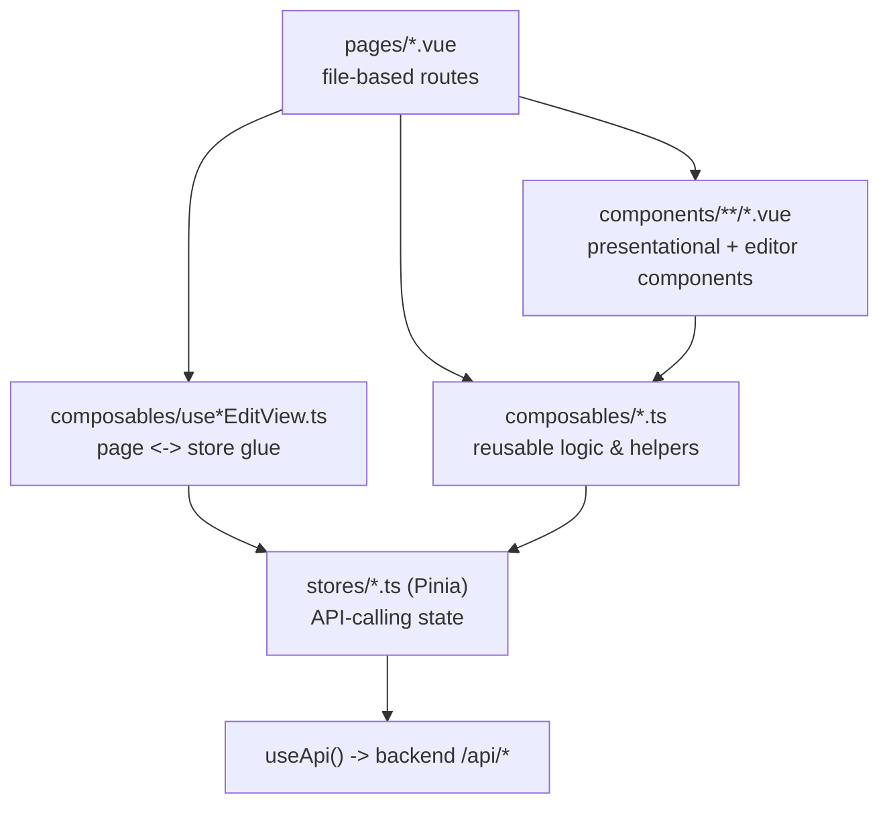

# Frontend

🇬🇧 English | [🇫🇷 Français](frontend.fr.md)

## Summary

- [Overview](#overview)
- [Components](#components)
  - [Branding & buttons](#branding--buttons)
  - [Common](#common)
  - [Cookbook](#cookbook)
  - [Forms](#forms)
  - [Import / export](#import--export)
  - [Layout](#layout)
  - [Planning](#planning)
  - [Recipes](#recipes)
  - [Search](#search)
  - [Settings](#settings)
  - [Icons](#icons)
- [Stores](#stores)
- [Composables](#composables)
- [Main pages](#main-pages)

This document is the "which file do I touch for X" reference for the Nuxt 4
/ Vue 3 frontend (`frontend/app/`). It's split the way the user asked for
it, in dependency order: **components** (what renders), **stores** (what
calls the API), **composables** (the logic gluing the two together), then
**pages** (what actually uses all of the above). Every name is
cross-linked to its own definition elsewhere in this document, so you can
jump from a page straight to the store action it triggers.

For the system-level picture (how the frontend talks to the backend, dev
vs prod, etc.), see [`docs/architecture.md`](architecture.md).

---

## Overview

Most pages are thin: a page under `recipes/`, `cookbooks/` or `planning/`
typically just renders one `*Editor.vue` component and lets a matching
`use*EditView.ts` composable (e.g. [`useRecipesEditView`](#userecipeseditview))
own the form state, validation and store calls. Read/list pages call a
domain composable (e.g. [`useRecipes`](#userecipes)) which wraps the
matching store. See [Main pages](#main-pages) for the full breakdown.

---

## Components

Grouped by subfolder under `frontend/app/components/`. The **Depends on**
line under each table lists the composables/stores/child components it
uses directly, linked to their own section below - that's the fastest way
to trace "what breaks if I change this composable's return shape".

The `icons/` folder (~35 trivial single-glyph SVGs) is condensed into one
list at the [end](#icons) instead of one row per icon.

### Branding & buttons

| Component | Purpose | Props | Emits | Slots |
| --- | --- | --- | --- | --- |
| `AppLogo.vue` | SUPMEAL logo image with an optional caption/tagline underneath | `tagline?: string`; `size?: "sm"\|"md"\|"lg"` (default `"md"`) | - | - |
| `buttons/AppButton.vue` | Generic styled button/link - renders `<button>` or `NuxtLink` depending on whether `to` is set | `variant?: "primary"\|"secondary"\|"destructive"\|"ghost"\|"oauth"` (default `"primary"`); `size?: "sm"\|"md"\|"lg"` (default `"md"`); `type?: "button"\|"submit"\|"reset"` (default `"button"`); `disabled?: boolean`; `block?: boolean`; `to?: string` | - | `icon` (leading icon); default (label/content) |
| `buttons/OAuthButtons.vue` | Google (disabled, "coming soon") and Microsoft OAuth sign-in buttons; starts the Microsoft flow on click | - | - | - |

- `OAuthButtons.vue` - Composables: [useOAuth](#useoauth). Children: [AppButton](#appbutton), icons.

### Common

| Component | Purpose | Props | Emits | Slots |
| --- | --- | --- | --- | --- |
| `common/ConfirmModal.vue` | Generic confirmation modal (teleported to body); can gate confirm behind a typed word and/or a checkbox | `open: boolean`; `title: string`; `message: string`; `confirmLabel?: string` (default `"Confirmer"`); `cancelLabel?: string` (default `"Annuler"`); `variant?: "default"\|"destructive"`; `typedWord?: string`; `checkboxLabel?: string` | `close: []`; `confirm: []` | - |
| `common/Pagination.vue` | Numbered pagination control, prev/next + windowed (max 5) page numbers | `currentPage: number`; `totalPages: number` | `update:currentPage: [page: number]` | - |
| `common/ToastContainer.vue` | Renders global toast notifications (success/warning/error), teleported to body | - | - | - |

- `ToastContainer.vue` - Stores: [useToastStore](#usetoaststore). Rendered once, from `layouts/app.vue`.
- Used across almost every editor/list component for destructive-action confirmation ([DeleteCookbookModal](#deletecookbookmodal), [DeletePlanningModal](#deleteplanningmodal), [DeleteRecipeModal](#deleterecipemodal) are thin wrappers around `ConfirmModal`'s pattern with domain-specific copy).

### Cookbook

| Component | Purpose | Props | Emits | Slots |
| --- | --- | --- | --- | --- |
| `cookbook/AssignCookbookMenu.vue` | Dropdown list of the user's own (creator-role) cookbooks, to reassign a recipe/planning into a different one | `currentCookbookId?: number \| null` | `select: [cookbook: { id: number; name: string }]` | - |
| `cookbook/CookbookCard.vue` | Grid card for a personal cookbook: icon, name, recipe/planning counts, updated time, "..." menu (view/edit/delete) | `cookbook: Cookbook`; `to: string`; `showMenu?: boolean` (default `true`) | - | - |
| `cookbook/CookbookDiscussionSidebar.vue` | Right-hand sidebar (rendered from `layouts/app.vue`) with a per-cookbook discussion: channel selector (general/recipe/planning), messages, send/delete | `cookbookId: number`; `defaultChannel: CookbookDiscussionDefault` | - | - |
| `cookbook/CookbookEditor.vue` | Create/edit form for a cookbook: name, icon upload, save/delete, back navigation | `mode: "create" \| "edit"`; `cookbookId?: number` | - | - |
| `cookbook/CookbookMembersPanel.vue` | Lists creator + shared members; owner can invite by email, change a role, or remove access | `cookbookId: number`; `creator`; `sharedWith: SharedUserCookbook[]`; `isOwner: boolean` | - | - |
| `cookbook/DeleteCookbookModal.vue` | Destructive confirm modal for deleting a cookbook; can keep its recipes/plannings as personal instead, gated behind typing "suppression" | `open: boolean`; `cookbookName: string`; `recipes?: {id,title}[]`; `plannings?: {id,name}[]` | `close: []`; `confirm: [options: { keepRecipes: boolean; keepPlannings: boolean }]` | - |
| `cookbook/SharedCookbookCard.vue` | Compact row card for a cookbook shared with the current user: icon, name, owner, activity time, role badge | `cookbook: Cookbook`; `role: Exclude<CookbookRole,"admin">`; `to: string`; `activityAt?: string` | - | - |

- `AssignCookbookMenu.vue` - Stores: [useCookbookStore](#usecookbookstore). Composables: [useAuth](#useauth), `hasCookbookRank` ([useCookbooks](#usecookbooks)).
- `CookbookCard.vue` - Composables: [useRecipes](#userecipes) (`relativeTime`), [useCookbooksEditView](#usecookbookseditview) (`deleteCookbookWithOptions`). Stores: [useToastStore](#usetoaststore). Children: [DeleteCookbookModal](#deletecookbookmodal).
- `CookbookDiscussionSidebar.vue` - **Calls [useApi](#useapi) directly**, not through a store, against the nested messaging routes (`/cookbooks/{id}/messages/`, `.../recipes/{id}/messages/`, `.../plannings/{id}/messages/`) - see [`stores/cookbooks/useMessageStore.ts`](#usemessagestore-empty) for why. Also uses [useAuth](#useauth), [useCookbooks](#usecookbooks). Stores: [useCookbookStore](#usecookbookstore), [useToastStore](#usetoaststore).
- `CookbookEditor.vue` - Composables: [useCookbooksEditView](#usecookbookseditview) (`useCookbookEditForm`), [useGoBack](#usegoback). Children: [DeleteCookbookModal](#deletecookbookmodal).
- `CookbookMembersPanel.vue` - Stores: [useCookbookStore](#usecookbookstore), [useToastStore](#usetoaststore). Composables: [useCookbooks](#usecookbooks) (`COOKBOOK_ROLE_LABELS`).
- `SharedCookbookCard.vue` - Composables: [useCookbooks](#usecookbooks) (`COOKBOOK_ROLE_LABELS`), [useRecipes](#userecipes) (`relativeTime`).

Used by: [`pages/cookbooks/index.vue`](#main-pages), [`.../new.vue`](#main-pages), [`.../[id]/view.vue`](#main-pages), [`.../[id]/edit.vue`](#main-pages), plus `CookbookCard`/`SharedCookbookCard` on [`pages/home.vue`](#main-pages) and [`pages/sharedwithme.vue`](#main-pages).

### Forms

| Component | Purpose | Props | Emits | Slots |
| --- | --- | --- | --- | --- |
| `forms/AppInput.vue` | Labeled text input, optional leading-icon slot, error/hint text, built-in show/hide toggle for `type="password"` | `modelValue?: string`; `id: string`; `label?: string`; `type?: string` (default `"text"`); `placeholder?: string`; `autocomplete?: string`; `hint?: string`; `error?: string` | `update:modelValue: [value: string]` | `icon` (leading icon) |

- Used on every auth/settings form: [`pages/login.vue`](#main-pages), [`register.vue`](#main-pages), [`settings.vue`](#main-pages).

### Import / export

| Component | Purpose | Props | Emits | Slots |
| --- | --- | --- | --- | --- |
| `import_export/ExportSelectionList.vue` | Searchable, paginated, multi-select checklist (recipes/cookbooks/plannings) with "select all filtered" + export button | `items: SelectableItem[]`; `loading?: boolean`; `exporting?: boolean`; `emptyLabel?: string`; `searchPlaceholder?: string` | `export: [ids: number[]]` | - |
| `import_export/ImportDropzone.vue` | Drag-and-drop (or browse) zone for a single `.json` file, with preview/clear and import button; exposes `clearFile()` | `label: string`; `busy?: boolean` | `import: [file: File]` | - |

- `ExportSelectionList.vue` - Uses the `SelectableItem` type from [useImportExport](#useimportexport). Children: [Pagination](#pagination).
- `ImportDropzone.vue` - Composables: [useImportExport](#useimportexport) (`isJsonFile`), VueUse `useDropZone`. Stores: [useToastStore](#usetoaststore).
- Both used exclusively by [`pages/import_export.vue`](#main-pages).

### Layout

| Component | Purpose | Props | Emits | Slots |
| --- | --- | --- | --- | --- |
| `layout/AppSidebar.vue` | Fixed left app sidebar: avatar, logo, primary nav (home/recipes/cookbooks/shared/planning/search/import-export), user name, settings, logout | - | - | - |

- Composables: [useAuth](#useauth). Rendered once, from `layouts/app.vue` (see [Main pages](#main-pages) for which pages use that layout).

### Planning

| Component | Purpose | Props | Emits | Slots |
| --- | --- | --- | --- | --- |
| `planning/DeletePlanningModal.vue` | Destructive confirm modal for deleting a planning, gated behind typing "suppression" | `open: boolean`; `planningName: string` | `close: []`; `confirm: []` | - |
| `planning/MealPlanEditor.vue` | Editable meal-plan grid (moment x course x day); each cell is a [RecipePicker](#recipepicker) | `type: PlanningType`; `slots: MealSlot[]`; `recipes?: Recipe[]` | `update-slot: [key: string, pick: RecipePick]` | - |
| `planning/PlanningCard.vue` | List card for a planning: icon, name, type/meal-count/updated time, "..." menu (view/edit/reassign cookbook/delete) | `planning: Planning`; `to: string`; `canEdit?/canManage?/canReassignCookbook?: boolean` (default `true`); `showMenu?: boolean` | - | - |
| `planning/PlanningEditor.vue` | Create/edit form for a planning: name, icon, type selector (create-only), cookbook badge, meal-plan grid | `mode: "create" \| "edit"`; `planningId?: number` | - | - |
| `planning/PlanningMealsGrid.vue` | Read-only meal-plan grid, scheduled recipes as links, for viewing an existing planning | `type: PlanningType`; `meals: PlanningMeal[]` | - | - |
| `planning/RecipePicker.vue` | Single-cell recipe autocomplete (`v-model`) used inside [MealPlanEditor](#mealplaneditor); searches the user's recipes, or filters a fixed `recipes` list when scoped to a cookbook | `expanded?: boolean`; `recipes?: Recipe[]`; model: `defineModel<RecipePick>` | `update:modelValue` (implicit) | - |

- `MealPlanEditor.vue` - Composables: [usePlanning](#useplanning) (`DAYS_OF_WEEK`/`MEAL_MOMENTS`/`MEAL_COURSES`/`DAILY_PLANNING_DAY`). Children: [RecipePicker](#recipepicker).
- `PlanningCard.vue` - Stores: [usePlanningStore](#useplanningstore), [useToastStore](#usetoaststore). Composables: [useRecipes](#userecipes) (`relativeTime`), [usePlanning](#useplanning) (`PLANNING_TYPE_LABELS`). Children: [DeletePlanningModal](#deleteplanningmodal), [AssignCookbookMenu](#assigncookbookmenu).
- `PlanningEditor.vue` - Composables: [usePlanningEditView](#useplanningeditview) (`usePlanningEditForm`), [usePlanning](#useplanning), [useGoBack](#usegoback). Children: [MealPlanEditor](#mealplaneditor), [DeletePlanningModal](#deleteplanningmodal).
- `PlanningMealsGrid.vue` - Composables: [usePlanning](#useplanning) (constants + `mealsByDayAndSlot`).
- `RecipePicker.vue` - Composables: [useRecipes](#userecipes) (`searchMyRecipes`).

Used by: [`pages/planning/index.vue`](#main-pages), `new.vue`, `[id]/view.vue`, `[id]/edit.vue`.

### Recipes

| Component | Purpose | Props | Emits | Slots |
| --- | --- | --- | --- | --- |
| `recipes/DeleteRecipeModal.vue` | Destructive confirm modal for deleting a recipe; warns if used in plannings, gated behind typing "suppression" | `open: boolean`; `recipeTitle: string`; `usedInPlannings?: PlanningUsage[]` | `close: []`; `confirm: []` | - |
| `recipes/IngredientRow.vue` | Single ingredient line: name with catalogue autocomplete, quantity/unit/person-count, image upload, duplicate warning, remove | `isDuplicate?: boolean`; `excludeIngredientIds?: number[]`; model: `defineModel<IngredientLine>` | `update:modelValue` (implicit); `remove: []` | - |
| `recipes/IngredientsPanel.vue` | Wraps a list of [IngredientRow](#ingredientrow)s, "add ingredient" button, default-portions field | model: `defineModel<IngredientLine[]>` | `update:modelValue` (implicit) | - |
| `recipes/RecipeCard.vue` | Grid card for a recipe: image, title, tags toggle, favorite toggle, "..." menu (view/edit/reassign cookbook/delete) | `recipe: Recipe`; `to: string`; `canEdit?/canManage?/canReassignCookbook?: boolean`; `showMenu?: boolean` | - | - |
| `recipes/RecipeEditor.vue` | Create/edit form for a recipe: title, image, source, cooking duration, steps, ingredients, tags, save/delete | `mode: "create" \| "edit"`; `recipeId?: number` | - | - |
| `recipes/StepEditor.vue` | Single recipe-step editor: Tiptap WYSIWYG (bold/italic/bullet list) serialized to markdown, type (prep/cook) selector, duration, reorder/remove | `index: number`; `total: number`; model: `defineModel<StepLine>` | `update:modelValue` (implicit); `remove: []`; `move-up: []`; `move-down: []` | - |
| `recipes/TagsPanel.vue` | Add/remove a recipe's tags: type filter (meal/diet), search-and-pick existing tags, or create a new one | model: `defineModel<TagLine[]>` | `update:modelValue` (implicit) | - |

- `DeleteRecipeModal.vue` - no notable dependencies beyond icons.
- `IngredientRow.vue` - Stores: [useRecipeStore](#userecipestore). Composables: [useRecipes](#userecipes) (`fileToDataUrl`).
- `IngredientsPanel.vue` - Composables: [useRecipes](#userecipes) (`emptyIngredientLine`). Children: [IngredientRow](#ingredientrow).
- `RecipeCard.vue` - Stores: [useRecipeStore](#userecipestore), [useToastStore](#usetoaststore). Composables: [useRecipes](#userecipes), [useCookbooks](#usecookbooks) (`useCookbookName`). Children: [DeleteRecipeModal](#deleterecipemodal), [AssignCookbookMenu](#assigncookbookmenu).
- `RecipeEditor.vue` - Composables: [useRecipesEditView](#userecipeseditview) (`useRecipeEditForm`), [useGoBack](#usegoback). Children: [StepEditor](#stepeditor), [IngredientsPanel](#ingredientspanel), [TagsPanel](#tagspanel), [DeleteRecipeModal](#deleterecipemodal).
- `StepEditor.vue` - Third-party: `@tiptap/vue-3`, `@tiptap/starter-kit`, `@tiptap/extension-placeholder`, `tiptap-markdown`.
- `TagsPanel.vue` - Stores: [useRecipeStore](#userecipestore). Composables: [useRecipes](#userecipes) (`uid`, `capitalizeFirst`).

Used by: [`pages/new.vue`](#main-pages), [`pages/recipes/index.vue`](#main-pages), `[id]/view.vue`, `[id]/edit.vue`.

### Search

| Component | Purpose | Props | Emits | Slots |
| --- | --- | --- | --- | --- |
| `search/CatalogMultiSelect.vue` | Dropdown multi-select against a server-searched catalogue (tags/ingredients), bound to a comma-separated string; selected items shown as removable chips | `label: string`; `searchPlaceholder?: string`; `emptyLabel?: string`; `fetchOptions: (search: string) => Promise<{id,name,image?}[]>`; `capitalizeLabels?: boolean`; model: `defineModel<string>` | `update:modelValue` (implicit) | - |
| `search/CookbookSearchResults.vue` | Grid of [CookbookCard](#cookbookcard)s (loading skeletons / empty state / results) | `cookbooks: Cookbook[]`; `isLoading: boolean` | - | - |
| `search/PlanningSearchResults.vue` | Grid of [PlanningCard](#planningcard)s (loading skeletons / empty state / results) | `plannings: Planning[]`; `isLoading: boolean` | - | - |
| `search/RecipeSearchResults.vue` | Grid of [RecipeCard](#recipecard)s (loading skeletons / empty state / results) | `recipes: Recipe[]`; `isLoading: boolean` | - | - |
| `search/SearchFilters.vue` | Filter panel whose fields switch on `type` (recipes/plannings/cookbooks): name, ingredients/tags, cookbook/planning scope, favorites, prep/cooking time ranges, reset/search buttons | `type: SearchType`; `showCookbookScope?: boolean`; models: `recipeFilters`, `planningFilters`, `cookbookFilters` | `search: []`; `reset: []` | - |

- `CatalogMultiSelect.vue` - Composables: [useRecipes](#userecipes) (`capitalizeFirst`), VueUse `onClickOutside`.
- `SearchFilters.vue` - Stores: [useRecipeStore](#userecipestore). Composables: [usePlanning](#useplanning) (`PLANNING_TYPE_LABELS`). Children: [CatalogMultiSelect](#catalogmultiselect).

Used by: [`pages/search.vue`](#main-pages) (all four) and [`pages/cookbooks/[id]/view.vue`](#main-pages) (`SearchFilters` only, filtering a cookbook's own tabs).

### Settings

| Component | Purpose | Props | Emits | Slots |
| --- | --- | --- | --- | --- |
| `settings/CuisinePreferencesPanel.vue` | Manage the user's preferred cuisine/tag preferences: current preferences as removable chips, search-and-toggle against the tag catalogue | - | - | - |

- Stores: [useRecipeStore](#userecipestore). Composables: [useCuisinePreferences](#usecuisinepreferences), [useRecipes](#userecipes) (`capitalizeFirst`).
- Used by [`pages/settings.vue`](#main-pages).

### Icons

All ~35 files under `components/icons/` are trivial single-glyph SVGs
sharing one prop: `size?: "xs" | "sm" | "md" | "lg"` (default `"md"`).

`IconAlertTriangle`, `IconBold`, `IconBookmark` (+`filled?: boolean`),
`IconCalendar`, `IconCamera`, `IconCheck`, `IconChevron`
(+`direction?: "up"|"down"|"left"|"right"`, default `"down"`),
`IconChevronLeft`, `IconClock`, `IconClose`, `IconCookbook`, `IconDots`,
`IconDownload`, `IconEdit`, `IconEye`, `IconEyeOff`, `IconGoogle`,
`IconHome`, `IconImportExport`, `IconItalic`, `IconListBullet`,
`IconLogout`, `IconMail`, `IconMicrosoft`, `IconPlus`, `IconRecipe`,
`IconSave`, `IconSearch`, `IconSend`, `IconSettings`, `IconShared`,
`IconStar`, `IconTag`, `IconTrash`, `IconUpload`, `IconUser`.

---

## Stores

Every Pinia store, and **every backend endpoint it calls** - this is the
list to check before assuming "there's probably a store method for that"
or before adding a new API call (add it here, don't call `useApi()` from a
component - see the one deliberate exception in
[`CookbookDiscussionSidebar`](#cookbookdiscussionsidebar)). All endpoints
are relative to `/api/`; full contract (params, response shape, status
codes) is in [`docs/api.md`](api.md).

### `useCookbookStore`

Id: `"cookbooks"`. Owns cookbook list/detail state, sharing, and a name cache.
State: `cookbooks`, `currentCookbook`, `cookbookNames` (id -> name cache), `pagination`, `loading`, `error`.

| Action | Method & endpoint | Purpose |
| --- | --- | --- |
| `fetchCookbooks(params)` | `GET /cookbooks/` | List/paginate cookbooks (`name`, `shared_with_me`, `page`, `page_size`) |
| `fetchCookbook(id)` | `GET /cookbooks/{id}/` | Load one cookbook's full detail |
| `createCookbook(payload)` | `POST /cookbooks/` | Create a cookbook |
| `updateCookbook(id, payload)` | `PATCH /cookbooks/{id}/` | Update name/icon |
| `deleteCookbook(id)` | `DELETE /cookbooks/{id}/` | Delete a cookbook |
| `shareCookbook(id, shares)` | `POST /cookbooks/{id}/share/` | Add/update shared members and roles |
| `unshareCookbook(id, userIds)` | `POST /cookbooks/{id}/unshare/` | Remove shared members |
| `fetchCookbookName(id)` | `GET /cookbooks/{id}/` (cached) | Resolve just a cookbook's name (breadcrumb-style labels) |

Used via [useCookbooks](#usecookbooks) / [useCookbooksEditView](#usecookbookseditview), by [AssignCookbookMenu](#assigncookbookmenu), [CookbookCard](#cookbookcard), [CookbookMembersPanel](#cookbookmemberspanel), [CookbookDiscussionSidebar](#cookbookdiscussionsidebar), and the [cookbooks pages](#main-pages).

### `useMessageStore` (empty)

`stores/cookbooks/useMessageStore.ts` is currently a **0-byte file** - not
imported or referenced anywhere. There is no dedicated message store;
[`CookbookDiscussionSidebar.vue`](#cookbookdiscussionsidebar) calls
[useApi](#useapi) directly against the `messaging` endpoints instead (see
[`docs/api.md`](api.md#5-messaging-messaging) and
[`docs/architecture.md`](architecture.md#how-the-pieces-communicate)). If a
message store is added later, this is the file it belongs in.

### `useImportExportStore`

Id: `"importExport"`. Owns JSON export/import request state for recipes and cookbooks.
State: `exportingRecipes`, `exportingCookbooks`, `importingRecipes`, `importingCookbooks`, `error`.

| Action | Method & endpoint | Purpose |
| --- | --- | --- |
| `exportRecipes(ids)` | `GET /recipes/export/` | Export all or selected personal recipes as JSON |
| `exportCookbooks(ids)` | `GET /cookbooks/export/` | Export all or selected owned cookbooks as JSON |
| `importRecipes(payload)` | `POST /recipes/import/` | Import recipe(s) from parsed JSON |
| `importCookbooks(payload)` | `POST /cookbooks/import/` | Import cookbook(s) from parsed JSON |

Used via [useImportExport](#useimportexport), by [ExportSelectionList](#exportselectionlist), [ImportDropzone](#importdropzone) and [`pages/import_export.vue`](#main-pages).

### `usePlanningStore`

Id: `"plannings"`. Owns meal-planning list/detail state.
State: `plannings`, `currentPlanning`, `pagination`, `loading`, `error`.

| Action | Method & endpoint | Purpose |
| --- | --- | --- |
| `fetchPlannings(params)` | `GET /plannings/` | List/paginate plannings (`name`, `type`, `cookbook`, `in_cookbook`, `shared_with_me`, `page`, `page_size`) |
| `fetchPlanning(id)` | `GET /plannings/{id}/` | Load one planning's full detail (meals grid) |
| `createPlanning(payload)` | `POST /plannings/` | Create a planning (with meal slots) |
| `updatePlanning(id, payload)` | `PATCH /plannings/{id}/` | Update name/icon/type/meals |
| `deletePlanning(id)` | `DELETE /plannings/{id}/` | Delete a planning |

Used via [usePlanning](#useplanning) / [usePlanningEditView](#useplanningeditview), by [PlanningCard](#planningcard), [PlanningEditor](#planningeditor) and the [planning pages](#main-pages).

### `useRecipeStore`

Id: `"recipes"`. Owns recipe list/detail state plus the shared tag/ingredient catalogues.
State: `recipes`, `currentRecipe`, `tags`, `ingredients`, `pagination`, `loading`, `error`.

| Action | Method & endpoint | Purpose |
| --- | --- | --- |
| `fetchRecipes(params)` | `GET /recipes/` | List/paginate recipes (`name`, `tags`, `ingredients`, `cookbook`, `in_cookbook`, `planning`, `in_planning`, `favorite`, `shared_with_me`, `page`, `page_size`) |
| `fetchRecipe(id)` | `GET /recipes/{id}/` | Load one recipe's full detail |
| `createRecipe(payload)` | `POST /recipes/` | Create a recipe (ingredients/tags/steps) |
| `updateRecipe(id, payload)` | `PATCH /recipes/{id}/` | Update a recipe |
| `deleteRecipe(id)` | `DELETE /recipes/{id}/` | Delete a recipe |
| `setFavorite(id, favorite)` | `POST` / `DELETE` `/recipes/{id}/favorite/` | Add/remove recipe from favorites |
| `fetchTags(search)` | `GET /tags/` | Fetch/search the shared tag catalogue |
| `fetchIngredients(search)` | `GET /ingredients/` | Fetch/search the shared ingredient catalogue |

Used via [useRecipes](#userecipes) / [useRecipesEditView](#userecipeseditview), by nearly every recipe-related component and [CuisinePreferencesPanel](#cuisinepreferencespanel), [SearchFilters](#searchfilters), [TagsPanel](#tagspanel), [IngredientRow](#ingredientrow).

### `useToastStore`

Id: `"toast"`. Owns the in-app toast notification queue. **No backend calls.**
State: `toasts` (array of `{id, type, message}`). Actions: `push()`, `success()`, `warning()`, `error()`, `remove(id)` - client-only, auto-dismiss via `setTimeout`.

Consumed by [ToastContainer](#toastcontainer) (renders it) and by nearly every store/composable that performs a mutation (success/error feedback).

### `useUserStore`

Id: `"user"`. Owns account-management (settings) mutations. Session/current-user state itself lives in [useAuth](#useauth), not here.
State: `loading`, `error`.

| Action | Method & endpoint | Purpose |
| --- | --- | --- |
| `updateUsername(id, username)` | `PATCH /users/{id}/` | Change the account's username |
| `changeEmail(newEmail, newPassword?)` | `POST /users/change-email/` | Change email (OAuth accounts also set a new local password) |
| `linkMicrosoftAccount(code)` | `POST /users/oauth/microsoft/link/` | Link a Microsoft account to the current session |
| `changePassword(currentPassword, newPassword)` | `POST /users/change-password/` | Change account password |
| `changeAvatar(dataUri)` | `POST /users/change-avatar/` | Update profile icon/avatar |
| `deleteAccount(id)` | `DELETE /users/{id}/` | Delete the user's account |

Each mutating action also calls `useAuth().updateUser(...)` to sync the
cached session user. Used via [useChangeEmail](#usechangeemail) /
[useChangePassword](#usechangepassword), by [`pages/settings.vue`](#main-pages).

---

## Composables

Reusable reactive logic under `frontend/app/composables/`. The
`use*EditView.ts` composables are the "page glue" layer: each one owns a
create/edit form's state *and* a matching view/detail composable, both
backed by a store.

| Composable | Purpose | Returns | Depends on |
| --- | --- | --- | --- |
| `useAPI.ts` (`useApi`) | Core HTTP client for the Django REST backend. Base URL from `runtimeConfig.public.apiUrl`; injects `Authorization: Bearer <access>` from [useToken](#usetoken); on `401` clears the session and redirects to `/login` client-side | `get/post/put/patch/del`, `extractMembers`, `extractData` | [useToken](#usetoken) |
| `useAuth.ts` | Session/auth state: login, register, logout, token refresh, rehydration on app start | `user`, `isAuthenticated`, `register()`, `login()`, `logout()`, `initAuth()`, `refreshSession()`, `setSession()`, `updateUser()`, `clearSession()` | [useApi](#useapi), [useToken](#usetoken) |
| `useToken.ts` | Raw access/refresh JWT storage (Nuxt `useState`, SSR-safe) | `access`, `refresh` (refs) | - (foundational) |
| `auth.ts` | Zod validation schemas for login/register forms | `loginSchema`, `registerSchema` | - |
| `useCookbooks.ts` | Role/permission helpers + list-fetch shortcuts for cookbooks | `COOKBOOK_ROLE_RANK`, `COOKBOOK_ROLE_LABELS`, `getCookbookRole()`, `hasCookbookRank()`, `getCookbookLastActivity()`, `useCookbookRoleFor()`, `useCookbooks()` -> `{store, fetchMyCookbooks, fetchRecentCookbooks, fetchSharedCookbooks}`, `useCookbookName()` | [useCookbookStore](#usecookbookstore), [useAuth](#useauth) |
| `useCookbooksEditView.ts` | Page-level logic for cookbook create/edit + view/detail (incl. cascading delete) | `deleteCookbookWithOptions()`, `useCookbookEditForm(props)`, `useCookbookView(cookbookId)` | [useCookbookStore](#usecookbookstore), [useRecipeStore](#userecipestore), [usePlanningStore](#useplanningstore), [useToastStore](#usetoaststore), [useAuth](#useauth), [useRecipes](#userecipes), [useCookbooks](#usecookbooks), [useCookbookDiscussionContext](#usecookbookdiscussioncontext) |
| `useCookbookDiscussionContext.ts` | Layout-level shared state: which cookbook's discussion sidebar (+ default channel) to show alongside the current page; auto-resets on navigation via a router guard | `useCookbookDiscussionContext()` -> `Ref<CookbookDiscussionContext \| null>` | - (used by `layouts/app.vue` + cookbook-scoped pages) |
| `useCuisinePreferences.ts` | Per-user, **localStorage-only** preferred cuisine/tag preferences (no backend field) | `preferences`, `isPreferred()`, `togglePreference()` | [useAuth](#useauth) (for keying by user id) |
| `useGoBack.ts` | Navigate back in app history, or fall back to a given route | `useGoBack(fallback)` | Nuxt router |
| `useImportExport.ts` | UI orchestration of JSON export/import (file validation, download, toasts) | `isJsonFile()`, `readJsonFile()`, `downloadJson()`, `useImportExport()` -> `{store, exportRecipes, exportCookbooks, importRecipes, importCookbooks}` | [useImportExportStore](#useimportexportstore), [useToastStore](#usetoaststore) |
| `useOAuth.ts` | Microsoft OAuth login/link flow (redirect + callback exchange) | `startOAuth(provider, mode)`, `finishOAuth(provider)` | [useApi](#useapi), [useAuth](#useauth) |
| `usePagination.ts` (`fetchAllPages`) | Walks every page of a paginated endpoint and concatenates results | `fetchAllPages<T>(fetchPage)` | - |
| `usePlanning.ts` | Planning domain constants/helpers (days, meal moments/courses, slot-grid generation) + list-fetch shortcuts | `DAYS_OF_WEEK`, `MEAL_MOMENTS`, `MEAL_COURSES`, `PLANNING_TYPE_LABELS`, `DAILY_PLANNING_DAY`, `slotUid()`, `generateEmptySlots()`, `planningToMealSlots()`, `mealsByDayAndSlot()`, `usePlanning()` -> `{store, fetchMyPlannings, fetchRecentPlannings}` | [usePlanningStore](#useplanningstore) |
| `usePlanningEditView.ts` | Page-level logic for planning create/edit + view/detail | `usePlanningEditForm(props)`, `usePlanningView(planningId)` | [usePlanningStore](#useplanningstore), [useToastStore](#usetoaststore), [useAuth](#useauth), [useRecipes](#userecipes), [usePlanning](#useplanning), [useCookbookStore](#usecookbookstore), [useCookbooks](#usecookbooks), [useCookbookDiscussionContext](#usecookbookdiscussioncontext) |
| `useRecipes.ts` | Recipe domain helpers (ingredient/tag/step builders, image validation, duration formatting, markdown rendering) + list-fetch shortcuts | Many pure helpers (`emptyIngredientLine`, `minutesToDury`/`duryToMinutes`, `fileToDataUrl`, `isAllowedImageFile`, `relativeTime`, `sumStepMinutes`, `formatCookingDuration`, `formatNumber`, `capitalizeFirst`, `renderStepMarkdown`, `recipeToIngredientLines/TagLines/StepLines`, `sortFavoritesFirst`), `useRecipes()` -> `{store, fetchMyRecipes, fetchRecentRecipes, searchMyRecipes, toggleFavorite}` | [useRecipeStore](#userecipestore) |
| `useRecipesEditView.ts` | Page-level logic for recipe create/edit + view/detail (incl. serving-size scaling) | `useRecipeEditForm(props)`, `useRecipeView(recipeId)` | [useRecipeStore](#userecipestore), [useToastStore](#usetoaststore), [useAuth](#useauth), [useCookbooks](#usecookbooks), [useCookbookDiscussionContext](#usecookbookdiscussioncontext), [useRecipes](#userecipes) |
| `useSearch.ts` | Search/filter state shapes + pure client-side filtering (used inside a single cookbook's already-loaded tabs) | Types (`RecipeFilterState`, `PlanningFilterState`, `CookbookFilterState`), `createRecipeFilters/createPlanningFilters/createCookbookFilters`, `filterRecipesLocally()`, `filterPlanningsLocally()` | [useRecipes](#userecipes) (`sumStepMinutes`) |
| `managingUser/changeemail.ts` (`useChangeEmail`) | Form logic for the "change email" settings form (OAuth-account special case requiring a new password) | `form`, `errors`, `isSubmitting`, `validate`, `submit()` | `useFormValidation`, `changeEmailSchema`, [useUserStore](#useuserstore), [useToastStore](#usetoaststore) |
| `managingUser/changepassword.ts` (`useChangePassword`) | Form logic for the "change password" settings form | `form`, `errors`, `isSubmitting`, `submit()` | `useFormValidation`, `changePasswordSchema`, [useUserStore](#useuserstore), [useToastStore](#usetoaststore) |
| `managingUser/schemas.ts` | Zod schemas for username/email/password change forms | `changeUsernameSchema`, `changeEmailSchema(requirePassword)`, `changePasswordSchema` | - |
| `managingUser/useZodForm.ts` (`useFormValidation`) | Generic reactive form + Zod validation helper | `form`, `errors`, `validate()` | - |

Used by: see the **Depends on** bullets under each [component](#components) and the **Composables/Stores used** column of [Main pages](#main-pages).

---

## Main pages

File-based routes under `frontend/app/pages/`. `layouts/app.vue` is the
authenticated shell (renders [AppSidebar](#appsidebar) +
[ToastContainer](#toastcontainer), plus
[CookbookDiscussionSidebar](#cookbookdiscussionsidebar) when
[useCookbookDiscussionContext](#usecookbookdiscussioncontext) is set);
`layouts/empty.vue` is bare; `layout: false` means no chrome at all. Every
route is gated by `middleware/auth.global.ts` except the public ones
(`/public_home`, `/login`, `/register`, `/logout`,
`/connect/microsoft/callback`).

### Auth / public

| Page (route) | Purpose | Components used | Composables/Stores used | Layout |
| --- | --- | --- | --- | --- |
| `public_home.vue` (`/public_home`) | Landing page for signed-out visitors | [AppLogo](#applogo), [AppButton](#appbutton) | - | `false` |
| `login.vue` (`/login`) | Email/password + OAuth login | [AppLogo](#applogo), [AppInput](#appinput), [AppButton](#appbutton), [OAuthButtons](#oauthbuttons) | [useAuth](#useauth) (`login`), `loginSchema` ([auth.ts](#composables)), `useFormValidation` | `false` |
| `register.vue` (`/register`) | Account registration (email/password + OAuth) | [AppLogo](#applogo), [AppInput](#appinput), [AppButton](#appbutton), [OAuthButtons](#oauthbuttons) | [useAuth](#useauth) (`register`), `registerSchema` ([auth.ts](#composables)), `useFormValidation` | `false` |
| `logout.vue` (`/logout`) | Logs out on mount, shows confirmation | [AppLogo](#applogo), [AppButton](#appbutton) | [useAuth](#useauth) (`logout`) | `false` |
| `connect/microsoft/callback.vue` (`/connect/microsoft/callback`) | Handles the Microsoft OAuth redirect (sign-in or account-link) | [AppLogo](#applogo) | [useOAuth](#useoauth) (`finishOAuth`) | `empty` |

### Recipes

| Page (route) | Purpose | Components used | Composables/Stores used | Layout |
| --- | --- | --- | --- | --- |
| `new.vue` (`/new`) | Create a new recipe | [RecipeEditor](#recipeeditor) (`mode="create"`) | [useRecipesEditView](#userecipeseditview), [useGoBack](#usegoback); [useRecipeStore](#userecipestore), [useToastStore](#usetoaststore) | `app` |
| `recipes/index.vue` (`/recipes`) | List/search personal recipes, paginated | [AppButton](#appbutton), [RecipeCard](#recipecard), [Pagination](#pagination) | [useRecipes](#userecipes) (`fetchMyRecipes`, `sortFavoritesFirst`) | `app` |
| `recipes/[id]/view.vue` (`/recipes/:id/view`) | Recipe detail - scaled ingredients, steps, favorite/delete/edit | [AppButton](#appbutton), [DeleteRecipeModal](#deleterecipemodal) | [useRecipesEditView](#userecipeseditview) (`useRecipeView`), [useRecipes](#userecipes), [useGoBack](#usegoback) | `app` |
| `recipes/[id]/edit.vue` (`/recipes/:id/edit`) | Edit an existing recipe | [RecipeEditor](#recipeeditor) (`mode="edit"`) | [useRecipesEditView](#userecipeseditview), [useGoBack](#usegoback) | `app` |

### Cookbooks

| Page (route) | Purpose | Components used | Composables/Stores used | Layout |
| --- | --- | --- | --- | --- |
| `cookbooks/index.vue` (`/cookbooks`) | List/search owned cookbooks, paginated | [AppButton](#appbutton), [CookbookCard](#cookbookcard), [Pagination](#pagination) | [useCookbooks](#usecookbooks) (`fetchMyCookbooks`) | `app` |
| `cookbooks/new.vue` (`/cookbooks/new`) | Create a new cookbook | [CookbookEditor](#cookbookeditor) (`mode="create"`) | [useCookbooksEditView](#usecookbookseditview), [useGoBack](#usegoback) | `app` |
| `cookbooks/[id]/view.vue` (`/cookbooks/:id/view`) | Cookbook detail - tabbed recipes/planning/members, filter + pagination per tab | [AppButton](#appbutton), [RecipeCard](#recipecard), [PlanningCard](#planningcard), [CookbookMembersPanel](#cookbookmemberspanel), [SearchFilters](#searchfilters), [Pagination](#pagination), [DeleteCookbookModal](#deletecookbookmodal) | [useCookbooksEditView](#usecookbookseditview) (`useCookbookView`), [useGoBack](#usegoback), [useCookbooks](#usecookbooks), [useSearch](#usesearch) | `app` |
| `cookbooks/[id]/edit.vue` (`/cookbooks/:id/edit`) | Edit an existing cookbook | [CookbookEditor](#cookbookeditor) (`mode="edit"`) | [useCookbooksEditView](#usecookbookseditview) | `app` |

### Planning

| Page (route) | Purpose | Components used | Composables/Stores used | Layout |
| --- | --- | --- | --- | --- |
| `planning/index.vue` (`/planning`) | List/search personal plannings, paginated | [AppButton](#appbutton), [PlanningCard](#planningcard), [Pagination](#pagination) | [usePlanning](#useplanning) (`fetchMyPlannings`) | `app` |
| `planning/new.vue` (`/planning/new`) | Create a new meal planning | [PlanningEditor](#planningeditor) (`mode="create"`) | [usePlanningEditView](#useplanningeditview), [useGoBack](#usegoback) | `app` |
| `planning/[id]/view.vue` (`/planning/:id/view`) | Planning detail - meals grid, edit/delete | [AppButton](#appbutton), [PlanningMealsGrid](#planningmealsgrid), [DeletePlanningModal](#deleteplanningmodal) | [usePlanningEditView](#useplanningeditview) (`usePlanningView`), [usePlanning](#useplanning), [useGoBack](#usegoback) | `app` |
| `planning/[id]/edit.vue` (`/planning/:id/edit`) | Edit an existing meal planning | [PlanningEditor](#planningeditor) (`mode="edit"`) | [usePlanningEditView](#useplanningeditview) | `app` |

### Home, search, settings & misc

| Page (route) | Purpose | Components used | Composables/Stores used | Layout |
| --- | --- | --- | --- | --- |
| `home.vue` (`/home`) | Authenticated dashboard: recent recipes/cookbooks/plannings, shared cookbook activity, "New" quick-create menu | [AppButton](#appbutton), [RecipeCard](#recipecard), [PlanningCard](#planningcard), [CookbookCard](#cookbookcard), [SharedCookbookCard](#sharedcookbookcard) | [useRecipes](#userecipes), [usePlanning](#useplanning), [useCookbooks](#usecookbooks), [useAuth](#useauth) | `app` |
| `search.vue` (`/search`) | Global search across recipes/plannings/cookbooks, backend filters + client-side quick name filter | [SearchFilters](#searchfilters), [RecipeSearchResults](#recipesearchresults), [PlanningSearchResults](#planningsearchresults), [CookbookSearchResults](#cookbooksearchresults) | [useCuisinePreferences](#usecuisinepreferences), [useSearch](#usesearch), [useRecipes](#userecipes); [useRecipeStore](#userecipestore), [usePlanningStore](#useplanningstore), [useCookbookStore](#usecookbookstore) | `app` |
| `import_export.vue` (`/import_export`) | Bulk JSON export/import for personal recipes and owned cookbooks | [ExportSelectionList](#exportselectionlist), [ImportDropzone](#importdropzone), [ConfirmModal](#confirmmodal) | [useApi](#useapi), [usePagination](#usepagination) (`fetchAllPages`), [useImportExport](#useimportexport) | `app` |
| `settings.vue` (`/settings`) | Account settings: avatar, username, email, password, Microsoft linking, cuisine preferences, account deletion | [AppButton](#appbutton), [AppInput](#appinput), [ConfirmModal](#confirmmodal), [CuisinePreferencesPanel](#cuisinepreferencespanel) | [useAuth](#useauth), [useOAuth](#useoauth), [useChangeEmail](#usechangeemail), [useChangePassword](#usechangepassword), [useRecipes](#userecipes); [useUserStore](#useuserstore), [useToastStore](#usetoaststore) | `app` |
| `sharedwithme.vue` (`/sharedwithme`) | List cookbooks shared with the current user (searchable) | [SharedCookbookCard](#sharedcookbookcard) | [useCookbooks](#usecookbooks) (`fetchSharedCookbooks`), [useAuth](#useauth) | `app` |
