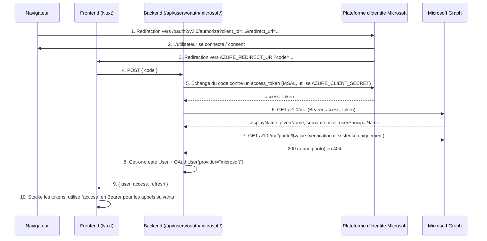

# OAuth

[🇬🇧 English](oauth.md) | 🇫🇷 Français

## Sommaire

- [Vue d'ensemble](#vue-densemble)
- [Routes concernées par OAuth](#routes-concernées-par-oauth)
- [Fonctionnement du flux Microsoft](#fonctionnement-du-flux-microsoft)
- [Lier Microsoft à un compte existant](#lier-microsoft-à-un-compte-existant)
- [Variables d'environnement](#variables-denvironnement)
- [Utilisation depuis un frontend](#utilisation-depuis-un-frontend)
- [Format de la réponse](#format-de-la-réponse)
- [Gestion des erreurs](#gestion-des-erreurs)
- [Ce qui est écrit en base de données](#ce-qui-est-écrit-en-base-de-données)
- [Ajouter un autre fournisseur](#ajouter-un-autre-fournisseur)
- [Tests](#tests)

Ce document explique comment la connexion OAuth (actuellement : Microsoft /
Entra ID) est intégrée à l'API, quelles routes sont concernées, et comment un
frontend est censé piloter le flux de bout en bout. Pour les définitions des
tables `User` / `OAuthUser`, voir [`docs/database.md`](database.fr.md).

---

## Vue d'ensemble

Un utilisateur peut soit s'inscrire avec un mot de passe local
(`/api/users/register/`), soit se connecter via un fournisseur d'identité
externe. Chaque identité externe est stockée sous forme de ligne dans
`OAuth_user`, liée à une ligne `user` - de sorte qu'un même compte puisse
être atteint via plusieurs fournisseurs au fil du temps, ou créé de zéro dès
la première connexion avec l'un d'eux.

`OAuth_user.provider` est une chaîne libre, pas une énumération : seul
`"microsoft"` est implémenté aujourd'hui, mais rien dans le schéma ne
restreint le champ à cette valeur.

Un utilisateur peut aussi **lier** une identité Microsoft à un compte qu'il
possède déjà - typiquement un compte créé avec un mot de passe local -
après coup, depuis la page de paramètres, sans avoir à se déconnecter au
préalable. C'est une route distincte de celle de connexion ; voir
[Lier Microsoft à un compte existant](#lier-microsoft-à-un-compte-existant)
ci-dessous.

Comme le secret client confidentiel (`AZURE_CLIENT_SECRET`) ne doit jamais
atteindre le navigateur, **c'est le backend - et non le frontend - qui
effectue l'échange du code d'autorisation avec Microsoft**. Le frontend n'a
que trois tâches : envoyer l'utilisateur vers Microsoft, récupérer le
`code` renvoyé par Microsoft, et transmettre ce `code` au backend.

## Routes concernées par OAuth

| Méthode | Route                        | Auth      | But                                                                          |
| ------ | ---------------------------- | --------- | --------------------------------------------------------------------------------- |
| `POST` | `/api/users/oauth/microsoft/` | `AllowAny` | Échange un `code` d'autorisation Microsoft contre des tokens ; crée ou relie l'utilisateur (connexion/inscription) |
| `POST` | `/api/users/oauth/microsoft/link/` | `IsAuthenticated` | Échange un `code` et rattache l'identité Microsoft au compte **déjà authentifié de l'appelant** |
| `POST` | `/api/users/token/refresh/`  | `AllowAny` | Rafraîchit un access token expiré (partagé avec la connexion par mot de passe) |
| `GET`  | `/api/users/me/`             | `IsAuthenticated` | Récupère le profil du propriétaire de l'access token courant        |

`/api/users/oauth/microsoft/` et `/api/users/oauth/microsoft/link/` sont les
deux seules routes spécifiques à OAuth. Tout ce qui suit (rafraîchir les
tokens, appeler `/me/`, etc.) est indiscernable d'une connexion classique
par mot de passe - chaque flux converge vers la même paire de JWT (la
liaison n'en émet même pas de nouvelle - voir plus bas).

## Fonctionnement du flux Microsoft



Étape par étape, côté backend (`backend/users/oauth_microsoft.py`) :

1. `exchange_code_for_token(code)` construit une
   `ConfidentialClientApplication` MSAL à partir de `AZURE_CLIENT_ID` /
   `AZURE_CLIENT_SECRET` / `AZURE_AUTHORITY` et appelle
   `acquire_token_by_authorization_code(code, scopes=["User.Read"], redirect_uri=AZURE_REDIRECT_URI)`.
   Le `redirect_uri` passé ici **doit correspondre exactement** à celui
   utilisé pour obtenir le code à l'étape 1 du diagramme - sinon Microsoft
   rejette l'échange.
2. `fetch_microsoft_profile(access_token)` appelle l'endpoint `/me` de Graph
   pour récupérer `mail` / `userPrincipalName`, `givenName`, `surname`.
3. `has_microsoft_photo(access_token)` sonde `/me/photo/$value` pour vérifier
   si le compte a une photo, sans la télécharger.
4. `get_or_create_user_from_microsoft(profile, access_token)` fait
   correspondre un `User` existant par email, ou en crée un, puis fait un
   `update_or_create` sur la ligne `OAuthUser(provider="microsoft")` liée.
5. La vue (`MicrosoftOAuthView`) émet la même paire de JWT que
   `RegisterView` / `LoginView` et renvoie `{ user, access, refresh }`.

Si le code est invalide/expiré, ou si le compte Microsoft n'a pas d'email,
la vue renvoie `400 Bad Request` avant toute écriture en base de données.

## Lier Microsoft à un compte existant

En plus de se connecter, un utilisateur **déjà authentifié** peut rattacher
son identité Microsoft au compte même sur lequel il est connecté - par
exemple quelqu'un qui s'est inscrit avec un mot de passe local et veut
maintenant que « Se connecter avec Microsoft » fonctionne aussi. C'est
l'action « Lier mon compte Microsoft » de la page de paramètres, adossée à
une route séparée, `POST /api/users/oauth/microsoft/link/`
(`LinkMicrosoftOAuthView`), et à une fonction de service séparée,
`link_microsoft_account()` dans `backend/users/oauth_microsoft.py`.

Elle réutilise exactement la même mécanique d'échange de code/récupération
de profil que le flux de connexion (`exchange_code_for_token`,
`fetch_microsoft_profile`, `has_microsoft_photo`), mais tout ce qui suit
diffère :

| | Connexion (`/oauth/microsoft/`) | Liaison (`/oauth/microsoft/link/`) |
| --- | --- | --- |
| **Auth requise** | `AllowAny` | `IsAuthenticated` |
| **Quel utilisateur** | Apparié/créé par l'email du profil | Toujours `request.user` - jamais apparié/créé par email |
| **En cas de succès** | Émet une nouvelle paire de JWT | N'émet **aucun token** - la session existante de l'appelant continue de fonctionner telle quelle |
| **Effet de bord sur le compte** | Aucun au-delà de sa création | `user.email` est écrasé par l'email du profil Microsoft, et `user.set_unusable_password()` est appelé |

Cette dernière ligne est importante : **la liaison est à sens unique et
destructive pour le mot de passe local**. Une fois lié, le compte ne peut
plus se connecter que via Microsoft - le mot de passe local cesse de
fonctionner entièrement, il n'est pas conservé comme solution de repli. La
fenêtre de confirmation du frontend (`pages/settings.vue`) l'indique
explicitement avant de démarrer la redirection.

```mermaid
sequenceDiagram
    participant Browser as Navigateur
    participant Frontend as Frontend (Nuxt, /settings)
    participant Backend as Backend (/api/users/oauth/microsoft/link/)
    participant MS as Plateforme d'identite Microsoft
    participant Graph as Microsoft Graph

    Browser->>MS: 1. Redirection vers /oauth2/v2.0/authorize?...&state=link
    MS->>Browser: 2. L'utilisateur se connecte / consent
    MS->>Frontend: 3. Redirection vers AZURE_REDIRECT_URI?code=...&state=link
    Frontend->>Backend: 4. POST { code }, Authorization: Bearer <access> (session courante)
    Backend->>MS: 5. Echange du code contre un access_token (MSAL, utilise AZURE_CLIENT_SECRET)
    MS-->>Backend: access_token
    Backend->>Graph: 6. GET /v1.0/me (Bearer access_token)
    Graph-->>Backend: displayName, givenName, surname, mail, userPrincipalName
    Backend->>Graph: 7. GET /v1.0/me/photo/$value (verification d'existence uniquement)
    Graph-->>Backend: 200 (a une photo) ou 404
    Backend->>Backend: 8. request.user.email = email du profil ; set_unusable_password() ; update_or_create OAuthUser(provider="microsoft")
    Backend-->>Frontend: 9. { user, detail }
    Frontend->>Frontend: 10. Met a jour l'utilisateur en cache - aucun nouveau token a stocker, la session est inchangee
```

Comme la liaison réutilise le même enregistrement d'app Azure et le même
redirect URI que la connexion (il n'y en a pas de second à configurer), le
frontend a besoin d'un moyen de distinguer une tentative de connexion d'une
tentative de liaison sur la page de callback partagée. Il fait cela avec le
paramètre OAuth `state`, que Microsoft renvoie tel quel :

1. `useOAuth().startOAuth("microsoft", mode)`
   (`frontend/app/composables/useOAuth.ts`) ajoute `state=login` ou
   `state=link` à l'URL d'autorisation selon l'action qui l'a déclenché -
   la page de paramètres l'appelle avec `"link"`, partout ailleurs c'est
   `"login"` par défaut.
2. `finishOAuth("microsoft")`, appelé depuis la page de callback partagée
   (`pages/connect/microsoft/callback.vue`), relit `route.query.state` et
   fait un branchement : `"link"` envoie un `POST` à
   `/oauth/microsoft/link/` et appelle `updateUser()` (rien à stocker) ;
   toute autre valeur envoie un `POST` à `/oauth/microsoft/` et appelle
   `setSession()` comme d'habitude.
3. En cas de succès, la page de callback redirige vers
   `/settings?linked=microsoft` (une connexion redirige elle vers `/home`) ;
   le paramètre `linked=microsoft` est ce qui déclenche le toast « Compte
   Microsoft lié avec succès. » sur `pages/settings.vue`.

**Échoue avec `400 Bad Request`** si `code` est manquant, si l'échange avec
Microsoft échoue de la même façon que pour la connexion, si le profil Graph
n'a pas d'email, **ou si cet email appartient déjà à un compte *différent***
(`User.objects.exclude(pk=user.pk).filter(email__iexact=email).exists()`) -
la liaison ne peut pas servir à s'approprier silencieusement le compte de
quelqu'un d'autre.

## Variables d'environnement

Définies dans le `.env` à la racine du dépôt (lu par `config/settings.py` de
la même manière que `DATABASE_*` ; injecté via `env_file` dans
`docker-compose.dev.yml` à l'intérieur des conteneurs) :

| Variable              | Signification                                                                          |
| ---------------------- | --------------------------------------------------------------------------------- |
| `AZURE_CLIENT_ID`      | ID d'application (client) de l'enregistrement d'app Azure AD                        |
| `AZURE_TENANT_ID`      | ID du tenant Azure AD dans lequel l'app est enregistrée                                      |
| `AZURE_CLIENT_SECRET`  | Secret client confidentiel - **backend uniquement**, jamais envoyé au frontend        |
| `AZURE_REDIRECT_URI`   | Doit correspondre à un redirect URI enregistré sur l'app Azure (actuellement la page `/connect/microsoft/callback` du frontend) |
| `AZURE_AUTHORITY`      | Autorité de la plateforme d'identité Microsoft, ex. `https://login.microsoftonline.com/common/v2.0` |

Les cinq variables ont des valeurs par défaut sûres (chaîne vide) dans
`settings.py`, de sorte que l'application démarre même sans être configurée
; la route OAuth elle-même échouera (400/500) tant qu'elles ne sont pas
renseignées.

## Utilisation depuis un frontend

Aucune bibliothèque MSAL.js ou autre côté client n'est nécessaire, puisque
le backend effectue l'échange du code. Une intégration frontend n'a que
trois choses à faire :

**1. Rediriger le navigateur vers Microsoft pour démarrer la connexion :**

```js
const params = new URLSearchParams({
  client_id: AZURE_CLIENT_ID, // public, peut etre expose
  response_type: "code",
  redirect_uri: "http://localhost:3000/connect/microsoft/callback",
  response_mode: "query",
  scope: "openid profile email User.Read",
});

window.location.href = `${AZURE_AUTHORITY}/oauth2/v2.0/authorize?${params}`;
```

**2. Sur la page de callback (`/connect/microsoft/callback`), lire `code`
dans la query string et l'envoyer au backend :**

```js
const code = new URLSearchParams(window.location.search).get("code");

const res = await fetch("/api/users/oauth/microsoft/", {
  method: "POST",
  headers: { "Content-Type": "application/json" },
  body: JSON.stringify({ code }),
});

if (!res.ok) {
  const { detail } = await res.json();
  throw new Error(detail);
}

const { user, access, refresh } = await res.json();
```

**3. Stocker `access` / `refresh` de la même manière qu'après une connexion
par mot de passe** (ex. store Pinia + stockage sécurisé), et joindre
`Authorization: Bearer <access>` aux appels API suivants. Quand `access`
expire, envoyer `refresh` en `POST` à `/api/users/token/refresh/` pour en
obtenir un nouveau - cette partie n'est pas spécifique au fournisseur.

Cette structure en trois étapes est aussi celle que réutilise une
intégration de **liaison** - même redirection, même page de callback -
simplement conditionnée par une session existante, postant vers une route
différente, sans token à stocker ensuite. Voir
[Lier Microsoft à un compte existant](#lier-microsoft-à-un-compte-existant)
pour le détail des différences et la façon dont le frontend distingue les
deux tentatives sur la page de callback partagée.

## Format de la réponse

**Connexion (`/oauth/microsoft/`), succès (`200 OK`)** - enveloppe
identique à `/api/users/login/` et `/api/users/register/` :

```json
{
  "user": {
    "id": 42,
    "username": "jane.doe",
    "first_name": "Jane",
    "last_name": "Doe",
    "email": "jane.doe@contoso.com",
    "profile_icon": "https://graph.microsoft.com/v1.0/me/photo/$value",
    "is_oauth": true,
    "created_at": "2026-07-25T10:00:00Z",
    "updated_at": "2026-07-25T10:00:00Z"
  },
  "access": "<jwt>",
  "refresh": "<jwt>"
}
```

**Liaison (`/oauth/microsoft/link/`), succès (`200 OK`)** - pas de paire de
tokens (la session existante de l'appelant n'est pas touchée), juste
l'utilisateur mis à jour et un message de confirmation :

```json
{
  "user": {
    "id": 42,
    "username": "jane.doe",
    "first_name": "Jane",
    "last_name": "Doe",
    "email": "jane.doe@contoso.com",
    "profile_icon": "https://graph.microsoft.com/v1.0/me/photo/$value",
    "is_oauth": true,
    "created_at": "2026-07-25T10:00:00Z",
    "updated_at": "2026-07-25T10:00:00Z"
  },
  "detail": "Microsoft account linked successfully. You can only sign in with Microsoft from now on."
}
```

`is_oauth` (`UserSerializer.get_is_oauth`, `user.oauth_accounts.exists()`)
est ce que le frontend vérifie pour décider d'afficher les champs de
paramètres liés au mot de passe ou l'appel à l'action « lier Microsoft » -
voir `pages/settings.vue`.

## Gestion des erreurs

**Connexion (`/oauth/microsoft/`)** - `400 Bad Request` dans trois cas,
tous renvoyés sous la forme `{ "detail": "<message>" }` :

- `code` absent du corps de la requête (validation du serializer).
- Microsoft rejette l'échange du code (code expiré/déjà utilisé, mauvais
  `redirect_uri`, consentement révoqué, ...).
- Le profil Graph n'a ni `mail` ni `userPrincipalName` pour identifier le
  compte.

**Liaison (`/oauth/microsoft/link/`)** - les trois mêmes cas, plus :

- `401 Unauthorized` en l'absence d'access token valide - contrairement à
  la connexion, cette route requiert une session existante.
- `400 Bad Request` si l'email du compte Microsoft appartient déjà à un
  compte **différent** (`{ "detail": "This Microsoft account's email is
  already used by another account." }`) - empêche la liaison de servir à
  s'approprier silencieusement le compte de quelqu'un d'autre.

## Ce qui est écrit en base de données

### Connexion / inscription (`/oauth/microsoft/`)

| Champ                    | Source                                                    |
| ------------------------- | ---------------------------------------------------------- |
| `User.username`           | Partie locale de `userPrincipalName` (ou `mail`), dédupliquée par un suffixe numérique si déjà prise |
| `User.first_name`         | `givenName` de Graph                                          |
| `User.last_name`          | `surname` de Graph                                            |
| `User.email`              | `mail` de Graph (repli sur `userPrincipalName`)                |
| `User.profile_icon`       | `https://graph.microsoft.com/v1.0/me/photo/$value` si le compte a une photo, sinon vide |
| `User.password`           | Inutilisable (`set_unusable_password()`) - les comptes OAuth-only n'ont pas de mot de passe local |
| `OAuthUser.provider`      | `"microsoft"`                                               |
| `OAuthUser.provider_url`  | `AZURE_AUTHORITY`                                           |
| `OAuthUser.profile_icon`  | Même URL de photo Graph que `User.profile_icon`                 |
| `OAuthUser.domain`        | Partie domaine de l'email (ex. `contoso.com`)                |

À noter : la valeur de photo stockée est l'**endpoint de l'API Graph**, pas
une URL d'image publique - y accéder nécessite un access token Microsoft
valide en en-tête `Bearer`, donc un `` frontend ne peut pas pointer
dessus directement. Si une URL d'image simple, chargeable par le navigateur,
s'avère nécessaire plus tard, il faudra télécharger la photo une fois et la
réhéberger (ex. stockage d'objets) plutôt que de ne stocker que le lien
Graph.

Un utilisateur existant est apparié **par email** (`OAuthUser` n'a pas de
colonne d'id externe séparée), donc si un compte avec le même email existe
déjà (local ou via un autre fournisseur), l'identité Microsoft lui est liée
au lieu de créer un utilisateur en double.

### Liaison à un compte existant (`/oauth/microsoft/link/`)

Aucune nouvelle ligne `User` n'est jamais créée ici - `request.user` est
mis à jour sur place :

| Champ                    | Source                                                    |
| ------------------------- | ---------------------------------------------------------- |
| `User.username`           | **Non touché** - contrairement à la connexion/inscription, la liaison ne dérive jamais un nom d'utilisateur du profil Microsoft |
| `User.first_name`/`last_name` | **Non touchés**                                        |
| `User.email`               | Écrasé par `mail` de Graph (repli sur `userPrincipalName`) |
| `User.password`           | Écrasé, rendu inutilisable (`set_unusable_password()`) - tout mot de passe local précédent cesse de fonctionner |
| `OAuthUser.provider`      | `"microsoft"` (`update_or_create`, donc relier après avoir délié se contente de rafraîchir la ligne existante plutôt que de la dupliquer) |
| `OAuthUser.provider_url`  | `AZURE_AUTHORITY`                                           |
| `OAuthUser.profile_icon`  | URL de photo Graph si le compte a une photo, sinon vide (`User.profile_icon` lui-même n'est **pas** touché par la liaison) |
| `OAuthUser.domain`        | Partie domaine du (nouvel) email                             |

Comme `User.email` est écrasé, une future *connexion* Microsoft avec ce
même compte Microsoft appariera correctement cet utilisateur par email -
mais un futur flux de réinitialisation/changement de mot de passe local
basé sur l'ancienne adresse email ne retrouverait plus ce compte.

## Ajouter un autre fournisseur

Comme `OAuthUser.provider` est une simple chaîne, ajouter Google/GitHub/etc.
plus tard ne nécessite pas de changement de schéma - seulement :

1. Un nouveau module de service (`users/oauth_<provider>.py`) reproduisant
   `oauth_microsoft.py` : échanger le code/token émis par le fournisseur,
   récupérer son endpoint de profil, appeler
   `get_or_create_user_from_<provider>` avec `provider="<provider>"`.
2. Une nouvelle vue + route sous `/api/users/oauth/<provider>/`.
3. De nouveaux réglages spécifiques au fournisseur (id/secret client/redirect
   URI).

La logique d'appariement par email peut être extraite de
`get_or_create_user_from_microsoft` si un second fournisseur est ajouté, afin
que les deux partagent le même comportement « apparier par email, sinon
créer ».

## Tests

`backend/tests/users/microsoft_oauth_test.py` couvre les deux routes de
bout en bout avec Microsoft simulé (`_confidential_client` et
`requests.get` patchés) - aucun appel réseau réel ni compte Microsoft n'est
nécessaire. Les cas spécifiques à la liaison
(`test_link_microsoft_requires_authentication`,
`test_local_user_can_link_microsoft_account`,
`test_linking_microsoft_account_already_used_by_another_user_fails`,
`test_link_microsoft_rejects_get_requests`) se trouvent dans le même
fichier, après ceux de connexion/inscription. L'exécuter avec :

```bash
docker compose -f docker-compose.dev.yml exec backend uv run pytest tests/users/microsoft_oauth_test.py -v
```
