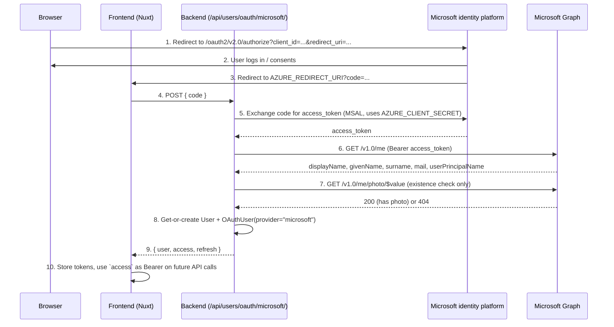

# OAuth

🇬🇧 English | [🇫🇷 Français](oauth.fr.md)

## Summary

- [Overview](#overview)
- [Routes concerned by OAuth](#routes-concerned-by-oauth)
- [How the Microsoft flow works](#how-the-microsoft-flow-works)
- [Environment variables](#environment-variables)
- [Using it from a frontend](#using-it-from-a-frontend)
- [Response shape](#response-shape)
- [Error handling](#error-handling)
- [What gets written to the database](#what-gets-written-to-the-database)
- [Adding another provider](#adding-another-provider)
- [Tests](#tests)

This document explains how OAuth login (currently: Microsoft / Entra ID) is
wired into the API, which routes are involved, and how a frontend is
expected to drive the flow end to end. For the `User` / `OAuthUser` table
definitions, see [`docs/database.md`](database.md).

---

## Overview

A user can either register with a local password (`/api/users/register/`)
or sign in through an external identity provider. Every external identity
is stored as a row in `OAuth_user`, linked to a `user` row - so a single
account can be reached through several providers over time, or created
from scratch the first time someone signs in with one.

`OAuth_user.provider` is a free-form string, not an enum: today only
`"microsoft"` is implemented, but nothing in the schema restricts it to
that value.

Because the confidential client secret (`AZURE_CLIENT_SECRET`) must never
reach the browser, **the backend - not the frontend - performs the
authorization-code exchange with Microsoft**. The frontend's only jobs are:
send the user to Microsoft, catch the `code` Microsoft sends back, and hand
that `code` to the backend.

## Routes concerned by OAuth

| Method | Route                        | Auth      | Purpose                                                                          |
| ------ | ---------------------------- | --------- | --------------------------------------------------------------------------------- |
| `POST` | `/api/users/oauth/microsoft/` | `AllowAny` | Exchanges a Microsoft authorization `code` for tokens; creates or links the user |
| `POST` | `/api/users/token/refresh/`  | `AllowAny` | Refreshes an expired access token (shared with password login)                   |
| `GET`  | `/api/users/me/`             | `IsAuthenticated` | Fetches the profile of whoever the current access token belongs to        |

`/api/users/oauth/microsoft/` is the only OAuth-specific route. Everything
after it (refreshing tokens, calling `/me/`, etc.) is indistinguishable
from a normal password login - both flows converge on the same JWT pair.

## How the Microsoft flow works



Step by step, on the backend side (`backend/users/oauth_microsoft.py`):

1. `exchange_code_for_token(code)` builds an MSAL `ConfidentialClientApplication`
   from `AZURE_CLIENT_ID` / `AZURE_CLIENT_SECRET` / `AZURE_AUTHORITY` and calls
   `acquire_token_by_authorization_code(code, scopes=["User.Read"], redirect_uri=AZURE_REDIRECT_URI)`.
   The `redirect_uri` passed here **must match exactly** the one used to
   obtain the code in step 1 of the diagram - Microsoft rejects the
   exchange otherwise.
2. `fetch_microsoft_profile(access_token)` calls Graph's `/me` endpoint to
   get `mail` / `userPrincipalName`, `givenName`, `surname`.
3. `has_microsoft_photo(access_token)` probes `/me/photo/$value` to check
   whether the account has a picture, without downloading it.
4. `get_or_create_user_from_microsoft(profile, access_token)` matches an
   existing `User` by email, or creates one, then `update_or_create`s the
   linked `OAuthUser(provider="microsoft")` row.
5. The view (`MicrosoftOAuthView`) issues the same JWT pair as
   `RegisterView` / `LoginView` and returns `{ user, access, refresh }`.

If the code is invalid/expired, or the Microsoft account has no email, the
view returns `400 Bad Request` before any database write happens.

## Environment variables

Defined in the repo-root `.env` (read by `config/settings.py` the same way
as `DATABASE_*`; injected via `env_file` in `docker-compose.dev.yml` inside
containers):

| Variable              | Meaning                                                                          |
| ---------------------- | --------------------------------------------------------------------------------- |
| `AZURE_CLIENT_ID`      | Application (client) ID of the Azure AD app registration                        |
| `AZURE_TENANT_ID`      | Azure AD tenant ID the app is registered in                                      |
| `AZURE_CLIENT_SECRET`  | Confidential client secret - **backend only**, never sent to the frontend        |
| `AZURE_REDIRECT_URI`   | Must match a redirect URI registered on the Azure app (currently the frontend's `/connect/microsoft/callback` page) |
| `AZURE_AUTHORITY`      | Microsoft identity platform authority, e.g. `https://login.microsoftonline.com/common/v2.0` |

All five have safe empty-string defaults in `settings.py` so the app still
boots without them configured; the OAuth route itself will fail (400/500)
until they're set.

## Using it from a frontend

No MSAL.js or client-side library is required, since the backend performs
the code exchange. A frontend integration only has to do three things:

**1. Redirect the browser to Microsoft to start the login:**

```js
const params = new URLSearchParams({
  client_id: AZURE_CLIENT_ID, // public, safe to expose
  response_type: "code",
  redirect_uri: "http://localhost:3000/connect/microsoft/callback",
  response_mode: "query",
  scope: "openid profile email User.Read",
});

window.location.href = `${AZURE_AUTHORITY}/oauth2/v2.0/authorize?${params}`;
```

**2. On the callback page (`/connect/microsoft/callback`), read `code` from
the query string and send it to the backend:**

```js
const code = new URLSearchParams(window.location.search).get("code");

const res = await fetch("/api/users/oauth/microsoft/", {
  method: "POST",
  headers: { "Content-Type": "application/json" },
  body: JSON.stringify({ code }),
});

if (!res.ok) {
  const { detail } = await res.json();
  throw new Error(detail);
}

const { user, access, refresh } = await res.json();
```

**3. Store `access` / `refresh` the same way as after a password login**
(e.g. Pinia store + secure storage), and attach `Authorization: Bearer
<access>` to subsequent API calls. When `access` expires, `POST` `refresh`
to `/api/users/token/refresh/` to get a new one - this part is not
provider-specific.

## Response shape

Success (`200 OK`), identical envelope to `/api/users/login/` and
`/api/users/register/`:

```json
{
  "user": {
    "id": 42,
    "username": "jane.doe",
    "first_name": "Jane",
    "last_name": "Doe",
    "email": "jane.doe@contoso.com",
    "profile_icon": "https://graph.microsoft.com/v1.0/me/photo/$value",
    "created_at": "2026-07-25T10:00:00Z",
    "updated_at": "2026-07-25T10:00:00Z"
  },
  "access": "<jwt>",
  "refresh": "<jwt>"
}
```

## Error handling

`400 Bad Request` in three cases, all returned as `{ "detail": "<message>" }`:

- `code` missing from the request body (serializer validation).
- Microsoft rejects the code exchange (expired/already-used code, wrong
  `redirect_uri`, revoked consent, ...).
- The Graph profile has neither `mail` nor `userPrincipalName` to key the
  account on.

## What gets written to the database

| Field                    | Source                                                    |
| ------------------------- | ---------------------------------------------------------- |
| `User.username`           | Local part of `userPrincipalName` (or `mail`), de-duplicated with a numeric suffix if taken |
| `User.first_name`         | Graph `givenName`                                          |
| `User.last_name`          | Graph `surname`                                            |
| `User.email`              | Graph `mail` (fallback: `userPrincipalName`)                |
| `User.profile_icon`       | `https://graph.microsoft.com/v1.0/me/photo/$value` if the account has a photo, else empty |
| `User.password`           | Unusable (`set_unusable_password()`) - OAuth-only accounts don't get a local password |
| `OAuthUser.provider`      | `"microsoft"`                                               |
| `OAuthUser.provider_url`  | `AZURE_AUTHORITY`                                           |
| `OAuthUser.profile_icon`  | Same Graph photo URL as `User.profile_icon`                 |
| `OAuthUser.domain`        | Domain part of the email (e.g. `contoso.com`)                |

Note the stored photo value is the **Graph API endpoint**, not a public
image URL - fetching it requires a valid Microsoft access token as a
`Bearer` header, so a frontend `` can't point at it directly. If a
plain, browser-loadable image URL is needed later, the photo will have to
be downloaded once and re-hosted (e.g. object storage) instead of only
storing the Graph link.

An existing user is matched **by email** (`OAuthUser` has no separate
external-id column), so if an account with the same email already exists
(local or via another provider), the Microsoft identity is linked to it
instead of creating a duplicate user.

## Adding another provider

Because `OAuthUser.provider` is a plain string, adding Google/GitHub/etc.
later doesn't require a schema change - just:

1. A new service module (`users/oauth_<provider>.py`) mirroring
   `oauth_microsoft.py`: exchange whatever code/token the provider issues,
   fetch its profile endpoint, call `get_or_create_user_from_<provider>`
   with `provider="<provider>"`.
2. A new view + route under `/api/users/oauth/<provider>/`.
3. New provider-specific settings (client id/secret/redirect URI).

The email-based linking logic can be factored out of
`get_or_create_user_from_microsoft` if a second provider is added, so both
share the same "match by email, else create" behavior.

## Tests

`backend/tests/users/microsoft_oauth_test.py` covers the route end to end
with Microsoft mocked out (`_confidential_client` and `requests.get`
patched) - no real network calls or Microsoft account are needed. Run it
with:

```bash
docker compose -f docker-compose.dev.yml exec backend uv run pytest tests/users/microsoft_oauth_test.py -v
```
