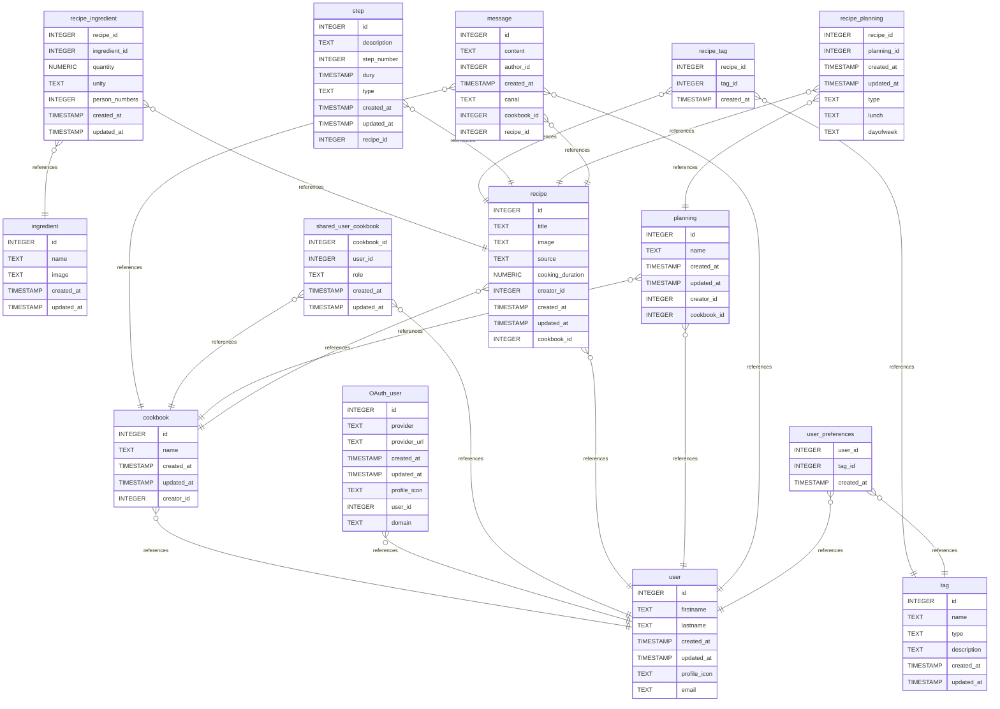

# SUPMEAL BDD documentation
## Summary

- [Introduction](#introduction)
- [Database Type](#database-type)
- [Table Structure](#table-structure)
	- [cookbook](#cookbook)
	- [recipe](#recipe)
	- [user](#user)
	- [tag](#tag)
	- [recipe_tag](#recipe_tag)
	- [ingredient](#ingredient)
	- [recipe_ingredient](#recipe_ingredient)
	- [OAuth_user](#oauth_user)
	- [shared_user_cookbook](#shared_user_cookbook)
	- [message](#message)
	- [step](#step)
	- [planning](#planning)
	- [recipe_planning](#recipe_planning)
	- [user_preferences](#user_preferences)
- [Relationships](#relationships)
- [Database Diagram](#database-diagram)

## Introduction

## Database type

- **Database system:** PostgreSQL
## Table structure

### cookbook

| Name           | Type      | Settings        | References                  | Note |
| -------------- | --------- | --------------- | --------------------------- | ---- |
| **id**         | INTEGER   | 🔑 PK, not null |                             |      |
| **name**       | TEXT      | not null        |                             |      |
| **created_at** | TIMESTAMP | not null        |                             |      |
| **updated_at** | TIMESTAMP | not null        |                             |      |
| **creator_id** | INTEGER   | not null        | fk_cookbook_creator_id_user |      |

### recipe

| Name            | Type      | Settings        | References                     | Note |
| --------------- | --------- | --------------- | ------------------------------ | ---- |
| **id**                 | INTEGER   | 🔑 PK, not null |                                |      |
| **title**              | TEXT      | not null        |                                |      |
| **image**              | TEXT      | null            |                                |      |
| **source**             | TEXT      | null            |                                |      |
| **cooking_duration**   | NUMERIC   | null            |                                |      |
| **creator_id**         | INTEGER   | not null        | fk_recipe_creator_id_user      |      |
| **created_at**         | TIMESTAMP | not null        |                                |      |
| **updated_at**         | TIMESTAMP | not null        |                                |      |
| **cookbook_id**        | INTEGER   | null            | fk_recipe_cookbook_id_cookbook |      |

### user

| Name             | Type      | Settings        | References | Note |
| ---------------- | --------- | --------------- | ---------- | ---- |
| **id**           | INTEGER   | 🔑 PK, not null |            |      |
| **firstname**    | TEXT      | not null        |            |      |
| **lastname**     | TEXT      | not null        |            |      |
| **created_at**   | TIMESTAMP | not null        |            |      |
| **updated_at**   | TIMESTAMP | not null        |            |      |
| **profile_icon** | TEXT      | not null        |            |      |
| **email**        | TEXT      | not null        |            |      |

### tag

| Name            | Type      | Settings        | References | Note |
| --------------- | --------- | --------------- | ---------- | ---- |
| **id**          | INTEGER   | 🔑 PK, not null |            |      |
| **name**        | TEXT      | not null        |            |      |
| **type**        | TEXT      | not null        |            |      |
| **description** | TEXT      | null            |            |      |
| **created_at**  | TIMESTAMP | not null        |            |      |
| **updated_at**  | TIMESTAMP | not null        |            |      |

### recipe_tag

| Name           | Type      | Settings        | References                     | Note |
| -------------- | --------- | --------------- | ------------------------------ | ---- |
| **recipe_id**  | INTEGER   | 🔑 PK, not null | fk_recipe_tag_recipe_id_recipe |      |
| **tag_id**     | INTEGER   | 🔑 PK, not null | fk_recipe_tag_tag_id_tag       |      |
| **created_at** | TIMESTAMP | not null        |                                |      |

### ingredient

| Name           | Type      | Settings        | References | Note |
| -------------- | --------- | --------------- | ---------- | ---- |
| **id**         | INTEGER   | 🔑 PK, not null |            |      |
| **name**       | TEXT      | not null        |            |      |
| **image**      | TEXT      | null            |            |      |
| **created_at** | TIMESTAMP | not null        |            |      |
| **updated_at** | TIMESTAMP | not null        |            |      |

### recipe_ingredient

| Name               | Type      | Settings        | References                                    | Note |
| ------------------ | --------- | --------------- | --------------------------------------------- | ---- |
| **recipe_id**      | INTEGER   | 🔑 PK, not null | fk_recipe_ingredient_recipe_id_recipe         |      |
| **ingredient_id**  | INTEGER   | 🔑 PK, not null | fk_recipe_ingredient_ingredient_id_ingredient |      |
| **quantity**       | NUMERIC   | not null        |                                               |      |
| **unity**          | TEXT      | null            |                                               |      |
| **person_numbers** | INTEGER   | not null        |                                               |      |
| **created_at**     | TIMESTAMP | not null        |                                               |      |
| **updated_at**     | TIMESTAMP | not null        |                                               |      |

### OAuth_user

| Name             | Type      | Settings        | References                 | Note |
| ---------------- | --------- | --------------- | -------------------------- | ---- |
| **id**           | INTEGER   | 🔑 PK, not null |                            |      |
| **provider**     | TEXT      | not null        |                            |      |
| **provider_url** | TEXT      | not null        |                            |      |
| **created_at**   | TIMESTAMP | not null        |                            |      |
| **updated_at**   | TIMESTAMP | not null        |                            |      |
| **profile_icon** | TEXT      | null            |                            |      |
| **user_id**      | INTEGER   | not null        | fk_OAuth_user_user_id_user |      |
| **domain**       | TEXT      | not null        |                            |      |

### shared_user_cookbook

| Name            | Type      | Settings        | References                                   | Note |
| --------------- | --------- | --------------- | -------------------------------------------- | ---- |
| **cookbook_id** | INTEGER   | 🔑 PK, not null | fk_shared_user_cookbook_cookbook_id_cookbook |      |
| **user_id**     | INTEGER   | 🔑 PK, not null | fk_shared_user_cookbook_user_id_user         |      |
| **role**        | TEXT      | not null        |                                              |      |
| **created_at**  | TIMESTAMP | not null        |                                              |      |
| **updated_at**  | TIMESTAMP | not null        |                                              |      |

### message

| Name            | Type      | Settings        | References                      | Note |
| --------------- | --------- | --------------- | ------------------------------- | ---- |
| **id**          | INTEGER   | 🔑 PK, not null |                                 |      |
| **content**     | TEXT      | not null        |                                 |      |
| **author_id**   | INTEGER   | not null        | fk_message_author_id_user       |      |
| **created_at**  | TIMESTAMP | not null        |                                 |      |
| **canal**       | TEXT      | not null        |                                 |      |
| **cookbook_id** | INTEGER   | not null        | fk_message_cookbook_id_cookbook |      |
| **recipe_id**   | INTEGER   | not null        | fk_message_recipe_id_recipe     |      |

### step

| Name            | Type      | Settings        | References               | Note |
| --------------- | --------- | --------------- | ------------------------ | ---- |
| **id**          | INTEGER   | 🔑 PK, not null |                          |      |
| **description** | TEXT      | not null        |                          |      |
| **step_number** | INTEGER   | not null        |                          |      |
| **dury**        | TIMESTAMP | not null        |                          |      |
| **type**        | TEXT      | not null        |                          |      |
| **created_at**  | TIMESTAMP | not null        |                          |      |
| **updated_at**  | TIMESTAMP | not null        |                          |      |
| **recipe_id**   | INTEGER   | not null        | fk_step_recipe_id_recipe |      |

### planning

| Name            | Type      | Settings        | References                       | Note |
| --------------- | --------- | --------------- | -------------------------------- | ---- |
| **id**          | INTEGER   | 🔑 PK, not null |                                  |      |
| **name**        | TEXT      | not null        |                                  |      |
| **created_at**  | TIMESTAMP | not null        |                                  |      |
| **updated_at**  | TIMESTAMP | not null        |                                  |      |
| **creator_id**  | INTEGER   | not null        | fk_planning_creator_id_user      |      |
| **cookbook_id** | INTEGER   | null            | fk_planning_cookbook_id_cookbook |      |

### recipe_planning

| Name            | Type      | Settings        | References                              | Note |
| --------------- | --------- | --------------- | --------------------------------------- | ---- |
| **recipe_id**   | INTEGER   | 🔑 PK, not null | fk_recipe_planning_recipe_id_recipe     |      |
| **planning_id** | INTEGER   | 🔑 PK, not null | fk_recipe_planning_planning_id_planning |      |
| **created_at**  | TIMESTAMP | not null        |                                         |      |
| **updated_at**  | TIMESTAMP | not null        |                                         |      |
| **type**        | TEXT      | not null        |                                         |      |
| **lunch**       | TEXT      | not null        |                                         |      |
| **dayofweek**   | TEXT      | null            |                                         |      |

### user_preferences

| Name           | Type      | Settings                       | References                       | Note |
| -------------- | --------- | ------------------------------ | -------------------------------- | ---- |
| **user_id**    | INTEGER   | 🔑 PK, not null, autoincrement | fk_user_preferences_user_id_user |      |
| **tag_id**     | INTEGER   | 🔑 PK, not null                | fk_user_preferences_tag_id_tag   |      |
| **created_at** | TIMESTAMP | not null                       |                                  |      |

## Relationships

- **recipe_ingredient to ingredient**: many_to_one
- **recipe_ingredient to recipe**: many_to_one
- **message to cookbook**: many_to_one
- **cookbook to user**: many_to_one
- **OAuth_user to user**: many_to_one
- **shared_user_cookbook to cookbook**: many_to_one
- **shared_user_cookbook to user**: many_to_one
- **recipe to user**: many_to_one
- **recipe_tag to recipe**: many_to_one
- **recipe_tag to tag**: many_to_one
- **step to recipe**: many_to_one
- **recipe_planning to planning**: many_to_one
- **recipe_planning to recipe**: many_to_one
- **planning to cookbook**: many_to_one
- **recipe to cookbook**: many_to_one
- **planning to user**: many_to_one
- **message to user**: many_to_one
- **message to recipe**: many_to_one
- **user_preferences to user**: many_to_one
- **user_preferences to tag**: many_to_one

## Database Diagram

